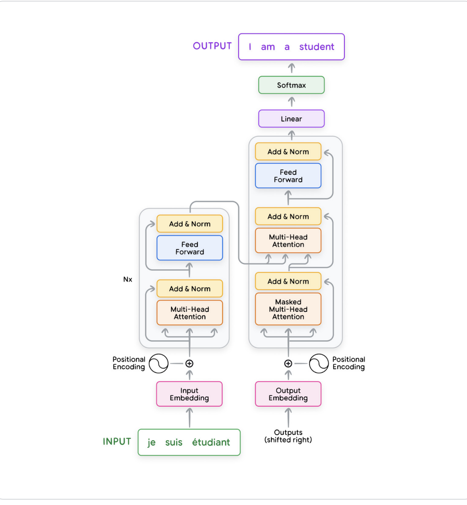

# Learning content for GEN AI from google/kaggle

### All the resources of the course are present in Notion Notebook and published: [Notion-Site](https://blushing-drink-f49.notion.site/Google-LLM-Training-131f681975c7805a8dcad214249130c6)

- Also placed all notebooks and learning resources in git repo, I will use the resource links from my own repo so that we will have control over the resource links and expiry : [repo - link](https://github.com/dinesh-coderepo/googlegenai)

### This blog contains the details and summary of the learnings and exercises from this intensive 5 day course and also provide highlights out of it.

## Week 1

- Week1 reading content contains what are foundations language models, basics on transformers , GPT evolution.
- Also contains intros to concepts like fine-tuning prompt-engineering and applications.
- Week1 contains two white papers another contains exclusive content on prompt engineering.

    ### [White paper : Foundational Large Language Models & Text Generation](https://github.com/dinesh-coderepo/googlegenai/blob/main/Week1_Newwhitepaper_Foundational%20Large%20Language%20models%20%26%20text%20generation.pdf)

- Summary and understanding from this paper
- How the initial models like RNNs had limitation in look back and training needs to be done sequentially
- there were also GRUs (Gated recurrent Units) and LSTM (Long short-term memory) with same limitations
- 

- Before continuing further going through a playlist created by [3Blue1Brown](https://youtube.com/playlist?list=PLZHQObOWTQDNU6R1_67000Dx_ZCJB-3pi&si=mAUM0EU7rB_r5eR9)
- This playlist contains visual references of core concepts on building a neural network. 
- Continuing to explore the playlist and other already existing resources in youtube to get indepth understanding 
- Keeping all the resources in one place - Notion and publishing for others to leverage these resources: [Notion Page](https://blushing-drink-f49.notion.site/deep-learning-ML-Neural-nets-106f681975c78053b5ddf338eae81567?pvs=4)
