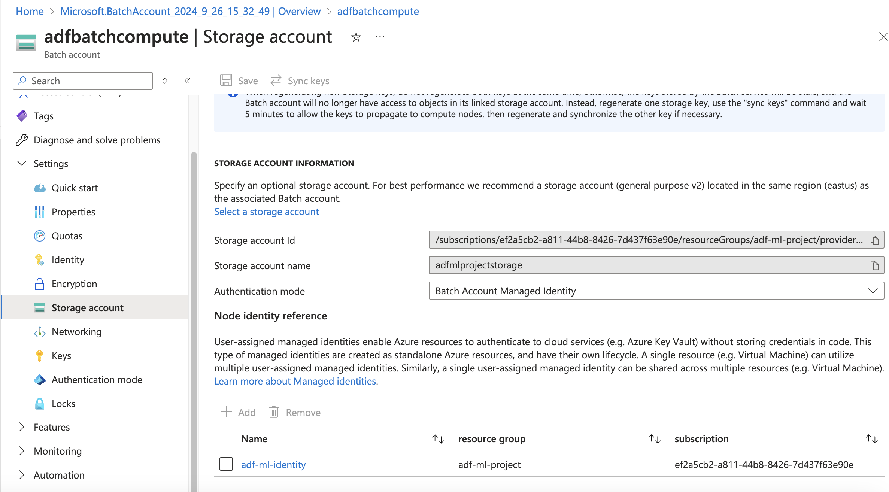

# Using ADF pipelines for orchestrating ML training & inference

## Introduction

In this blog post, we'll explore how to use Azure Data Factory (ADF) for orchestrating machine learning pipelines. We'll walk through the process of setting up a project and connecting it to Azure Data Factory.

## Project Setup

### Creating a GitHub Repository

To begin, we'll create a new repository on GitHub to store our project files.

### Setting Up Azure Resources

Next, we'll create a new resource group in Azure specifically for this project.

**Resource Group Name:** adf-ml-project

## Integrating with Azure Data Factory

### Connecting GitHub to ADF

To leverage version control and collaborative features, we'll connect our GitHub repository to Azure Data Factory.

1. In the Azure Data Factory interface, navigate to the "Author & Monitor" section.
2. Click on "Set up code repository" to begin the integration process.

### Authorizing ADF Access

During the setup, you'll be prompted to authorize Azure Data Factory to access your GitHub account. This step is crucial for enabling seamless integration between ADF and your code repository.

### Configuring Repository Settings

After authorization, configure the repository settings as follows:

### Key points to note:
    - Select your repository from the dropdown.
    - Choose the branch you want to use for development.
    - ADF will automatically create a "publish" branch for ARM templates.
    - Set the root folder to "src" to ensure all code resources are properly converted to JSON and stored in the correct location.

I will be using the MNIST dataset for this ML model : https://www.kaggle.com/code/prashant111/mnist-deep-neural-network-with-keras
In this version we will build everything from UI of ADF itself , but we will document all steps one by one.

### Creating a blob storage in the resource group which we will use for storing data and storing trained model

Using LRS type redundancy as Locally Redundant Storage is good for our usecase but for production systems it is better to have RA-GRS type redundancy as this is a GEO-redundant storage and copies 3 times locally and 3 times in the other region.

Created a container **adftrain** and folders for storing training data, inference data and trained model.

### Adding access to the storage account via linked service

Add the Managed Identity of the ADF workspace and provide **Contributor access** to the storage account as below.

Once added then add this account to the linked service in the ADF workspace. Validate with the Test Connection at the bottom to check if the connection is successful.

### Key points to note:
    - With the above steps we created a ADF workspace, Storage account and Linked Service to access storage account from ADF service.
    - Going forward we can keep publishing ARM template for any changes so that the repo : [https://github.com/dinesh-coderepo/adf-ml-project](https://github.com/dinesh-coderepo/adf-ml-project) , `branch : adf_publish` is updated with the latest changes.
    - Publishing to adf_publish involves some checks from ADF and then the ARM template is published.
    - Incase of any issues we can revert to the previous commit in the repo.
    - Ideally in production we should not publish the code changes directly to the repo without testing in the dev environment.
    - We can have a CI/CD pipeline to monitor any changes to adf_publish branch and it detects any changes it will deploy these to target environment such as staging and production
    - The deployment uses the ARM template to create update or delete resources in target ADF environment.
    - We will cover this entire setup in an another blog post.

### Data Flow Graph

To better visualize the flow of data in our ML pipeline, let's look at the following graph:

#### In this graph:
- A : External Source (in our case, keras.datasets)
- B : Local Processing (preprocessing if needed)
- C : Blob Storage (where we store our data and trained model)
- D : ML Model (training process)
- E : Prediction Service (for inference)

### Uploading data to blob storage

As part of next steps first we will get the mnist data from keras datasets and then upload it to blob storage. We are trying to mimic a real time scenario where we first get the data from some external source and then upload it to blob storage, in this case we are are getting the data from keras.datasets module then uploading it to blob storage.

### Creating a Batch Account to run the scripts we would need

- Attaching the storage account to the batch service, with user managed identity authentication.

- Created a User managed identity, added the contributor role to the storage account and added the identity to the batch account. After this we can link the storage account to the batch account.

- Creating a Batch Pool and added the commands to install the python packaged neccesary for the job

- After creating the pool we create a job with a task to run the script to download the data from keras.datasets and upload it to blob storage.

**with this setup we can replicate the same for training and inference by just changing the script in the task.**

- Follow below steps to configure to run the batch job in ADF pipeline 
- Note : Not Implemented in ADF and executed all the steps as the pool to run increases the cost for POC.
- In future I will be using this entire framework to implement a real world application.

### Below flow can illustrate the flow for dumping data using batch and ADF

### Running Azure Batch Jobs in ADF Pipeline

To integrate our Azure Batch job into the ADF pipeline, we'll follow these steps:

1. Create a Linked Service for Azure Batch
2. Create a Pipeline with Azure Batch Activity
3. Publish and Run the Pipeline

#### Create a Linked Service for Azure Batch

First, we need to create a Linked Service to connect ADF to our Azure Batch account:

1. In ADF Studio, go to the "Manage" tab
2. Select "Linked services" and click "New"
3. Search for and select "Azure Batch"
4. Configure the Linked Service with your Batch account details

#### Create a Pipeline with Azure Batch Activity

Now, let's create a pipeline that uses the Azure Batch Activity:

1. In ADF Studio, go to the "Author" tab
2. Create a new pipeline
3. Drag and drop the "Azure Batch" activity from the Activities pane
4. Configure the Azure Batch activity with your script details and Linked Services

#### Publish and Run the Pipeline

After setting up the pipeline:

1. Click "Publish All" to save your changes
2. Click "Add trigger" > "Trigger now" to run the pipeline manually

### Key points to note:
- Ensure your Python script is uploaded to the specified Blob storage container.
- The Azure Batch activity in ADF allows you to run your data processing and ML tasks at scale.
- You can add additional activities before or after the Batch activity for more complex workflows.
- This setup provides a scalable way to integrate your data processing and ML tasks into your ADF pipelines, allowing for better orchestration and management of your entire ML workflow.
