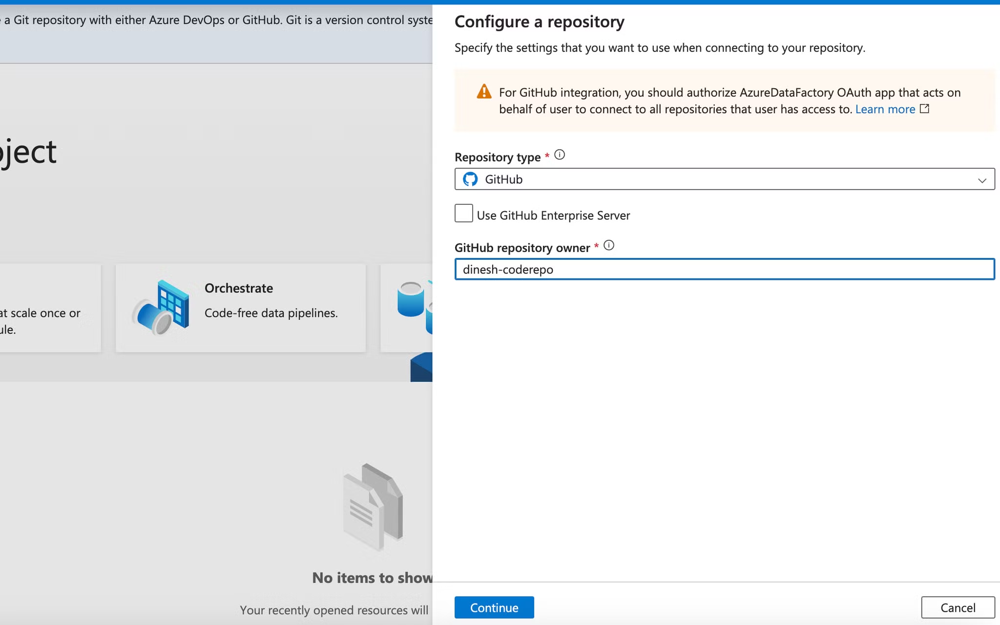

# Using ADF pipelines for orchestrating ML training & inference

## Introduction

In this blog post, we'll explore how to use Azure Data Factory (ADF) for orchestrating machine learning pipelines. We'll walk through the process of setting up a project and connecting it to Azure Data Factory.

## Project Setup

### Creating a GitHub Repository

To begin, we'll create a new repository on GitHub to store our project files.

### Setting Up Azure Resources

Next, we'll create a new resource group in Azure specifically for this project.

**Resource Group Name:** adf-ml-project

## Integrating with Azure Data Factory

### Connecting GitHub to ADF

To leverage version control and collaborative features, we'll connect our GitHub repository to Azure Data Factory.

1. In the Azure Data Factory interface, navigate to the "Author & Monitor" section.
2. Click on "Set up code repository" to begin the integration process.

### Authorizing ADF Access

During the setup, you'll be prompted to authorize Azure Data Factory to access your GitHub account. This step is crucial for enabling seamless integration between ADF and your code repository.

### Configuring Repository Settings

After authorization, configure the repository settings as follows:

Key points to note:
- Select your repository from the dropdown.
- Choose the branch you want to use for development.
- ADF will automatically create a "publish" branch for ARM templates.
- Set the root folder to "src" to ensure all code resources are properly converted to JSON and stored in the correct location.

## Next Steps

In the next part of this series, we'll dive deeper into creating and orchestrating ML pipelines within Azure Data Factory.

### Coming Soon!