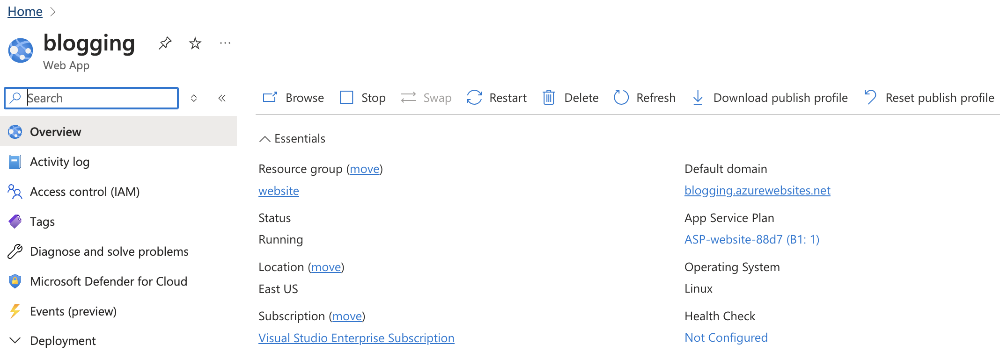

# Rapid Development and Deployment Using AI Tools

In this blog post, I'll share my experience using Cursor (an AI-powered development tool) and Microsoft Azure to streamline the process of developing and deploying a website. This combination has significantly accelerated my development and deployment cycle.

## Key Components

1. **Cursor**: An AI-assisted development environment to generate frontend and backend code.
2. **Azure**: Microsoft's cloud platform for deployment and hosting web app.
3. **GitHub Actions**: For continuous integration and deployment

## Setup and Development

### Locally to run the app using conda environment
To run the app locally, we need to setup conda environment and install all required packages.

1. Create a new conda environment

    `conda create -n blogger python=3.12`

2. Activate the conda environment

    `conda activate blogger`

3. Install the required packages

    `pip install -r requirements.txt`

```
    blinker==1.6.2
    certifi==2024.8.30
    charset-normalizer==3.3.2
    click==8.1.7
    Flask==3.0.3
    idna==3.8
    itsdangerous==2.2.0
    Jinja2==3.1.4
    Markdown==3.7
    MarkupSafe==2.1.3
    pip==24.2
    python-dotenv==1.0.1
    requests==2.32.3
    setuptools==72.1.0
    urllib3==2.2.2
    Werkzeug==3.0.3
    wheel==0.43.0
 ```

### Git repo for the project

As we will be using GitHub Actions for CI/CD, we need to setup a git repo for the project.

**Git repo** : [https://github.com/dinesh-coderepo/blogsite](https://github.com/dinesh-coderepo/blogsite)


### Package Management

To capture all required packages for deployment, whenever any new package is required first we locally install them in conda env, while deploying we use requirements.txt to install all the dependencies in virtual env. So keep running the below command whenever any new package is installed in conda env to maintain same package versions in App service env.

    # To get all the packages, which then can be installed later using pip
    # This is needed while deploying using GitHub Actions and while setting up virtual env
    pip list --format=freeze > requirements.txt

### Create a webapp in Azure :

1. Go to Azure portal and create a new resource.
2. Search for "Web App" and select it.
3. Fill in the required fields and create the webapp, select python 3.12 as the runtime stack.



### Setup GitHub Actions for CI/CD

1. Go to deployment center in the webapp and select GitHub actions.
2. Select your code repo and complete the setup.
3. Each time we push the code to GitHub, GitHub Actions will automatically run and deploy the code to Azure.


### Azure Web App Configuration
In the Azure portal:
1. Go to "Configuration" under the "Settings" section.
2. In the "General settings" tab, find the "Startup Command" field.
3. Enter the following command:

    gunicorn --bind 0.0.0.0:$PORT src.app:app

This tells Azure to run gunicorn and look for the app object in the src.app module.

### Domain Configuration
- Azure Web App domain: `blogging.azurewebsites.net`
- Custom domain bound to the web app: `dineshblog.com`

## Development Process

1. **Learning Resources and Code Generation**:
    - [Microsoft Learn: Building AI web apps with Python and Flask](https://learn.microsoft.com/en-us/training/modules/python-flask-build-ai-web-app/0-introduction?source=learn)
    - [MDN Web Docs: HTML basics](https://developer.mozilla.org/en-US/docs/Learn/Getting_started_with_the_web/HTML_basics)
    - Most of the code is generated using Cursor, with some modifications and additions by me.
    - Having high level understanding on what to develop is good, for blogging I am using markdown as my primary format to write blogs, to run this using flask.
    - Most of the html and CSS is generated keeping this in mind.
    - Also added a translation feature which you will find in the above tutorial. 

2. **Version Control**:
    - Project repository: [https://github.com/dinesh-coderepo/blogsite](https://github.com/dinesh-coderepo/blogsite)

3. **Azure Service Principal**:
      - The additional service principal is created to access the Azure Key Vault, this is done by creating an app registration and adding the service principal to have read access to the key vault.
      - Keep in mind we will be using two service principles, one for deployment using GitHub Actions and other for access azure services.
      - In order to have these keys for the Translation API, we are generating .env file and adding the keys to it.(their might be a better way to do it, but this worked for me)
      - Name: [bloggerdeployment](https://portal.azure.com/#view/Microsoft_AAD_RegisteredApps/ApplicationMenuBlade/~/Overview/quickStartType~/null/sourceType/Microsoft_AAD_IAM/appId/e91edd51-068a-4702-89de-5b674ab452dc/objectId/3fa0d802-a84e-450f-a12f-16a6967e5fed/isMSAApp~/false/defaultBlade/Overview/appSignInAudience/AzureADMyOrg/servicePrincipalCreated~/true)
      - Note: To access the Azure Key Vault, the service principal needs to be added to federated credentials in the app registration.

4. **Deployment**:
      - The deployment is done using GitHub Actions, the workflow is defined in the [.yml](https://github.com/dinesh-coderepo/blogsite/blob/main/.github/workflows/main_blogging.yml) file.
      - Successfully deployed using GitHub Actions: [Deployment Log](https://github.com/dinesh-coderepo/blogsite/actions/runs/10720927625/job/29728277249)

## Key Learnings and Tips

1. **Service Principal Authentication**: To login to a service principal and access the key vault, you need to add it to federated credentials in the app registration.

2. **Continuous Integration**: The project uses GitHub Actions for CI/CD, ensuring smooth and automated deployments.

3. **Resource Management**: Proper configuration of Azure resources, including the web app , custom domain , Azure key vault and service principal. Resources created normally are not accessible to the GitHub Actions workflow, this is done by adding the service principal to the app registration and adding it to the federated credentials.

4. **AI-Assisted Development**: Cursor's AI capabilities significantly speed up the coding process, allowing for rapid prototyping and development. The Cursor code editor is not only the available code integrated code gene

## Next Steps: Enhancing the Blog

For the next iteration, I plan to implement a blog-style website with a modern touch:

- Enhance the UI/UX to make it more modern and responsive.
- Add other tools like calculator to the blog site.
- Keep the blog updated with new content.

## Conclusion

Using IDE based AI code integration is better than chat-based tools for faster paced development, used cursor IDE (*trial pro version*) to genertae all the boiler plate code for backend flask and frontend html/css and test the code locally. Integrating to services like Azure App service , modifications in Github workflow script, integrating to keyvault and authentication did have few challenges while following the approach suggested by LLMs. There is long way to go to utilize only LLMs to deploy end to end software products. But this is a good starting point to integrate these code genertation tools to get the initial working layout and keep updating it in interations with specific goals in mind.
