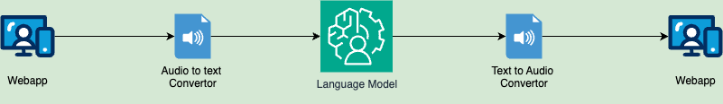
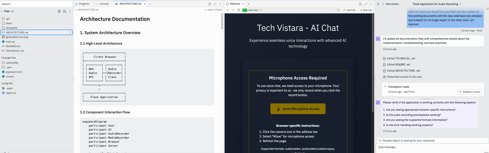
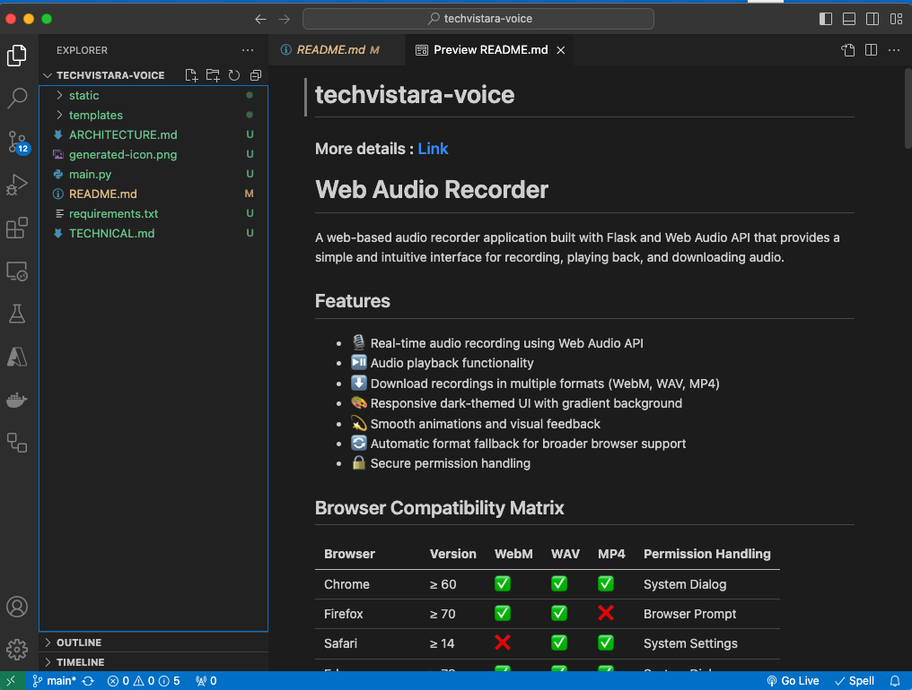
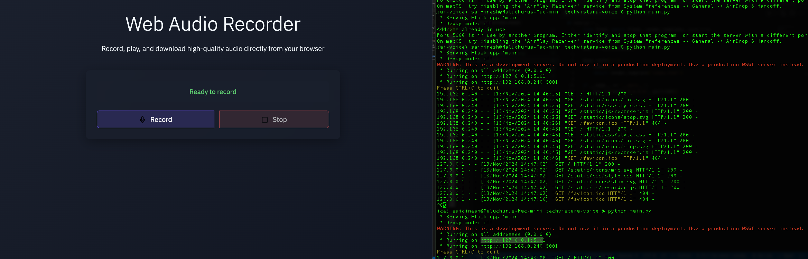
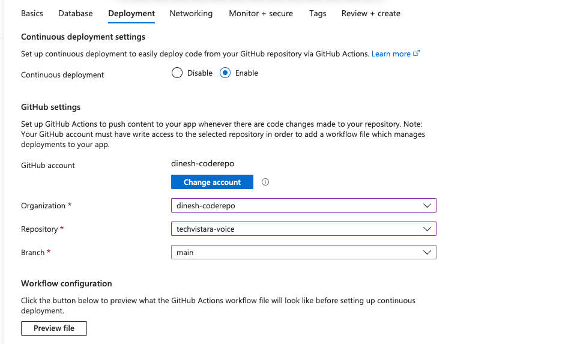
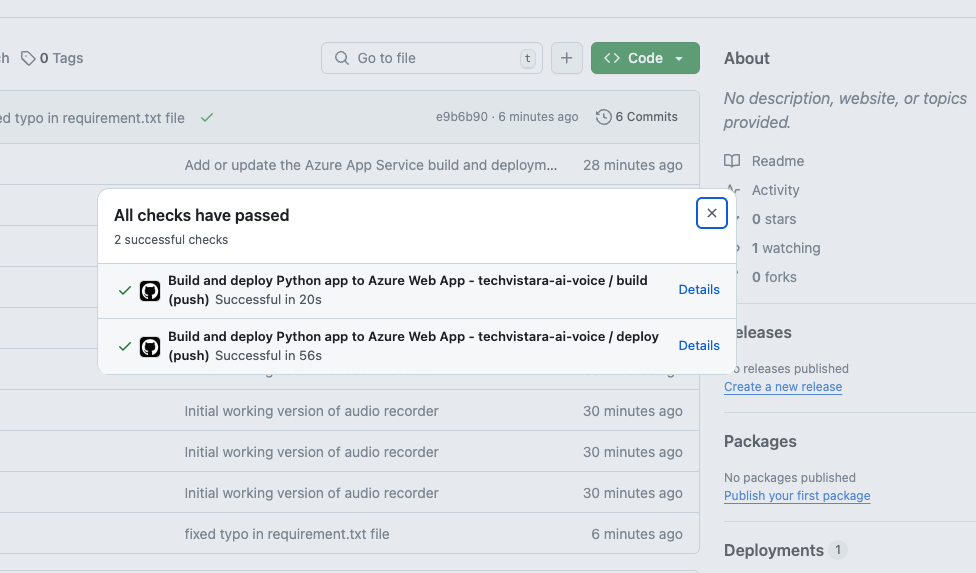
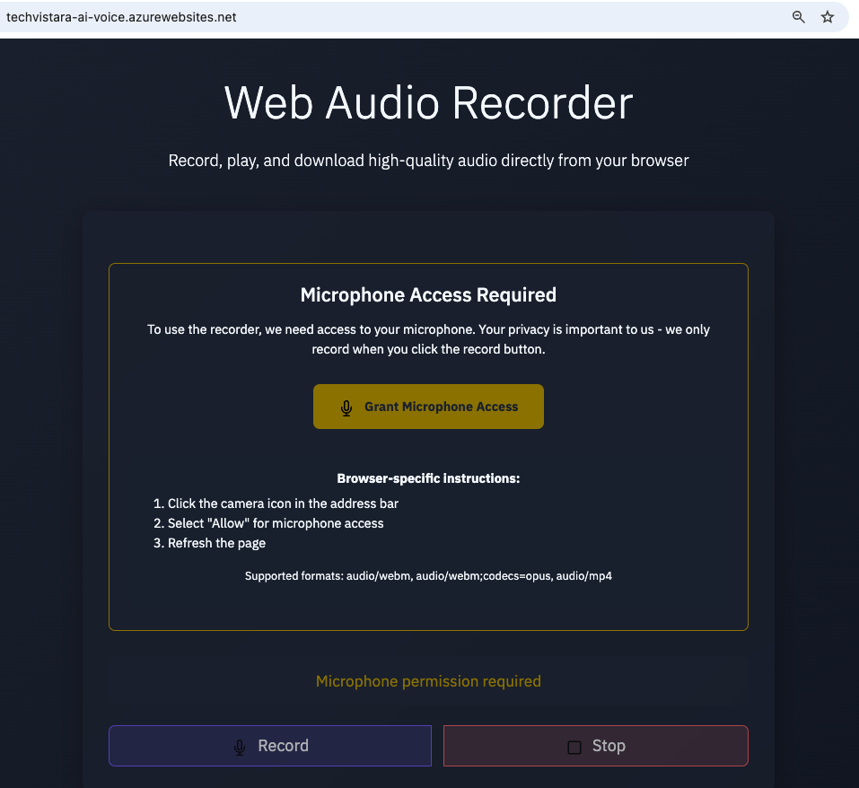

# Using Realtime speech LLMs to assist with service requests 
## Provide solutions and raise service tickets.


## App link : [techvistara-ai-voice.azurewebsites.net](techvistara-ai-voice.azurewebsites.net)

## Initial Architecture - Version V1

Link to the architecture diagram : [User draw.io to render](https://github.com/dinesh-coderepo/all-spec-draws/blob/main/AI-Voice-Support.drawio)




- Using webapp get the audio input from user with record button from UI
- Pass to a audio to text conversion tool (google or other services)
- Use LLM model - Open AI/Gemini to get the response back for the converted text
- Use text to speech to convert back the text generated from the Large language model
- Return the audio file to webapp

High level initial implementation for version 1 , later we will introduce chat like functionality, having context to the model on the topic, raising service tickets.(in future blogs)


## Part 1 : Recording audio from user and generating a audio file

### Using replit agent created a voice recording flask app which we can leverage



- Setting up the code base locally to test and to deploy this as webapp




- Pushing the code to the repo : [link](https://github.com/dinesh-coderepo/techvistara-voice)

- Creating a webapp and resource group to deploy and run this app in azure : [web app link](techvistara-ai-voice.azurewebsites.net)

- Enabling the deployment and attaching to the above repo, workflow yml : [yml](https://github.com/dinesh-coderepo/techvistara-voice/blob/main/.github/workflows/main_techvistara-ai-voice.yml)


- Following the initial [blog steps](https://dineshblog.com/blog/AIDeployment) to add startup command in app portal and configuring the app service to run the flask application

```
gunicorn --bind 0.0.0.0:$PORT main:app
```

- Successfully deploying the app to app service using github actions



- Verified the deployment by accessing the app service link, the web server is running successfully

### Link : [https://techvistara-ai-voice.azurewebsites.net/](https://techvistara-ai-voice.azurewebsites.net/)




### Building - Next steps
### coming soon


