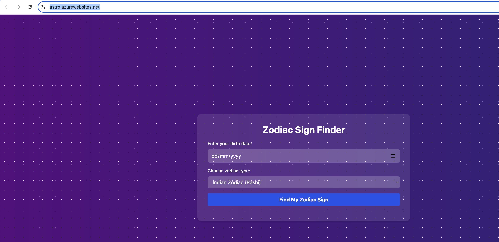
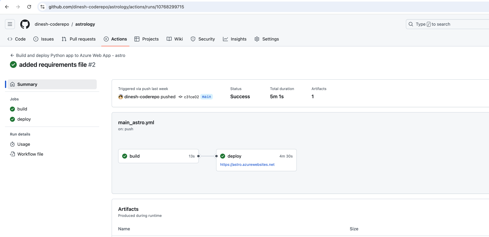
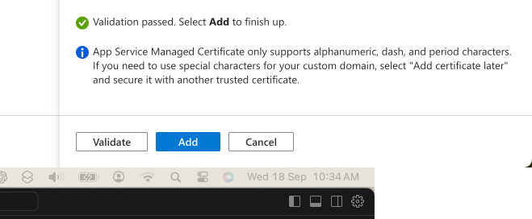
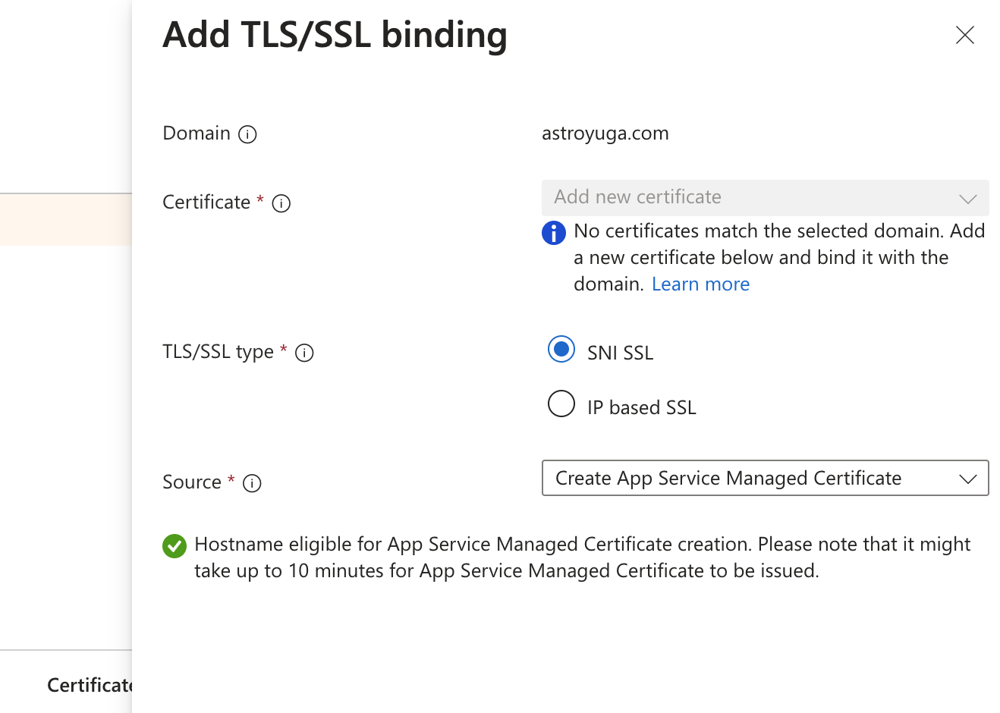
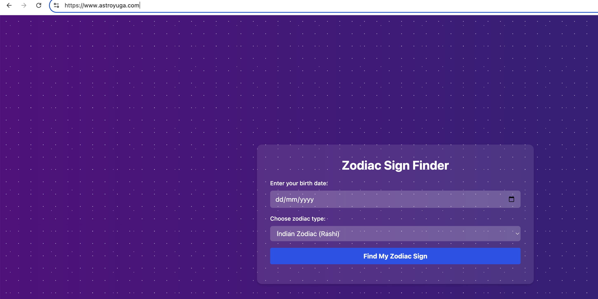

# Developing a Astrology web app using replit AI and deploying to webapp.

### Website : [www.astroyuga.com](https://www.astroyuga.com)

To kickstart our astrology web app, we'll leverage Replit AI to generate the basic placeholder for the initial version of the app to host. The idea is to develop a full-fledged subscription model app with the following features in a separate blog:

1. Customer Perspective:
   - Access via phone or mobile for daily predictions
   - Push notifications or email for daily astrology insights
   - Login using Google (initially)
   - Customer-specific view
   - Features:
     - One-time overall life prediction
     - Daily suggestions and weekly forecasts
   - Daily predictions should be actionable and suggestive:
     - What color to wear
     - What mantra to say
     - Recommended poojas
   - 1 week free prediction with monthly payment options
   - Paid content visible only to subscribed customers
   - Future scope: mobile app version

2. Technology Perspective:
   - Collate accurate astrology material
   - Research existing apps and implement successful flows
   - Integrate AI component (LLMs) for text-based content generation
   - Explore RAG (Retrieval-Augmented Generation) to integrate knowledge base with LLM

### Initial Placeholder app Development with Replit AI

1. **Generating Initial Version:**
   - Used Replit AI agent to create a placeholder app
   - AI executed and corrected code autonomously
   - Effective for small-scale projects

   

2. **Setup:**
   - AI agent set up dependencies and installation
   - Iterative error correction
   - Suitable for small-scale projects

   

3. **Generated Code:**
   - Available in Replit repo: [AstroGuide](https://replit.com/@maluchurudinesh/AstroGuide?v=1)

4. **Local Development:**
   - Imported code to local Cursor environment
   - Set up app to run locally
   - Replit can generate a README.md with dependency information

5. **Deployment and hosting:**
    - Initial version of the app is now ready , this is a placeholder version until all the other features are implemented and added.
    - Purchased the domain astroyuga.com in AWS.
    - Using the same approach as blogapp ,deploying to webapp using githubactions and then bind the domain to the webapp.
    - Binding of aws domain to webapp, I am doing this for the first time , will document the approach.

6. **CI and CD using github actions:**
    - Integrated the github to the app service, 
    - Git Hub Repo : [https://github.com/dinesh-coderepo/astrology](https://github.com/dinesh-coderepo/astrology)
    - Currently there is no need of .env file as we do not have keys as we needed for translation function in this blog.
    - Currently the app is running in [https://astro.azurewebsites.net/](https://astro.azurewebsites.net/)
    - 
    - GitHub actions script which is used to deploy :  [workflow.yml](https://github.com/dinesh-coderepo/astrology/blob/main/.github/workflows/main_astro.yml)
    - 

7. **Domain binding to webapp:**
    - In the webapp go to custom domains and add select Domain Provided as *All other domain services* leave remaining options as is.
    - Add the domain name in Domain section : [astroyuga.com](https://www.astroyuga.com)
    - For domain validatetion test the TXT value - copy it somewhere also you can export to CSV to local.
    - In AWS create a record with *asuid* as the record name , record type as *TXT* and add the value as the one you got from the webapp.
    - Same as above add the value of *A* by keeping record name as *blank* and record type as *A*
    - Validate in Azure portal once the records is added.
    - 
    - Add the binding after valildation, use App Service Managed Certificate to add this binding.
    - 
    - Also add another record for subdomain *www.* , add the record with *asuid.www* and add the value TXT copied (record type as TXT).
    - Enable *HTTPS Only* option in app service in Configuration tab to *On*
    - Domain binding is now complete and [www.astroyuga.com](https://www.astroyuga.com) is pointing to the webapp [https://astro.azurewebsites.net/](https://astro.azurewebsites.net/).
    - 

