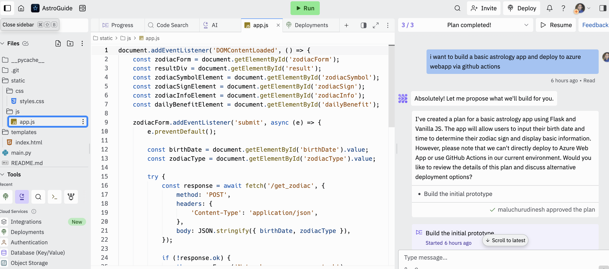

# Devloping a Astrology web app using replit AI to develop and deploy to webapp using cursor and github actions

## Using Replit AI to Generate Basic UI

To kickstart our astrology web app, we'll leverage Replit AI to generate the basic user interface. Idea is to use replit AI agent to generate a working model and then deploy using cursor and github actions.

### 1. Using replit AI pro subscription you get access to their AI Agent

*AI Agent is useful in this case because it executed the code and corrects the code on its own. It is not perfect but for small scale project it works great.*

### 2. The AI agent is very efficient in setting up dependencies and installation setup

*it also runs and sees the error and goes back to correct it. It is stil not perfect in all sense but for small scale project it works great.*

### 3. Code which it generated is availble in replit repo :

**Replit Repo** : [AstroGuide](https://replit.com/@maluchurudinesh/AstroGuide?v=1)

### 4. Imported the code to local cursor environment and setting up the app to run locally.

*In replit you can give instruction to add an Readme.md file which shows what dependencies you would need to setup locally*

