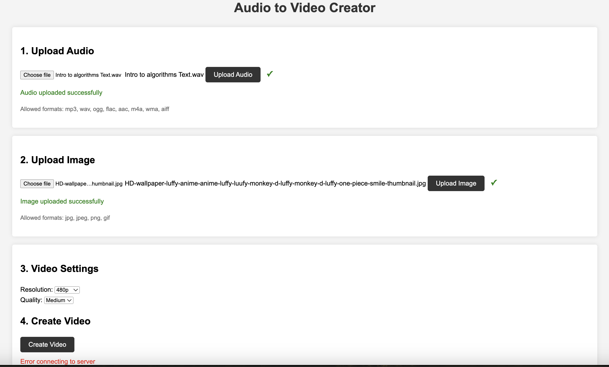
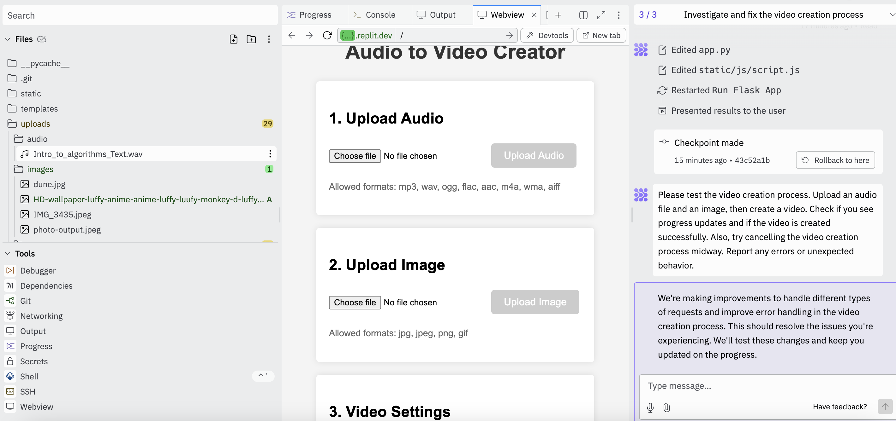

# Audio to Video Generation Tool 
## With the help of Replit AI and deployed to Webapp 

As there is currently a lot of audio content being released, such as Overview by NotebookLM from Google recently, building a tool to convert the voice to a video format to upload in certain video-only platforms is valuable.

[https://blog.google/technology/ai/notebooklm-audio-overviews/](https://blog.google/technology/ai/notebooklm-audio-overviews/)

## Initial Look of the Tool in Replit AI

* Using an audio file, in this case, we are using Google's NotebookLM downloaded audio.
* A custom image to appear on the video while playing.
* Generating the video with resolution selection.

## Replit Development interface 

