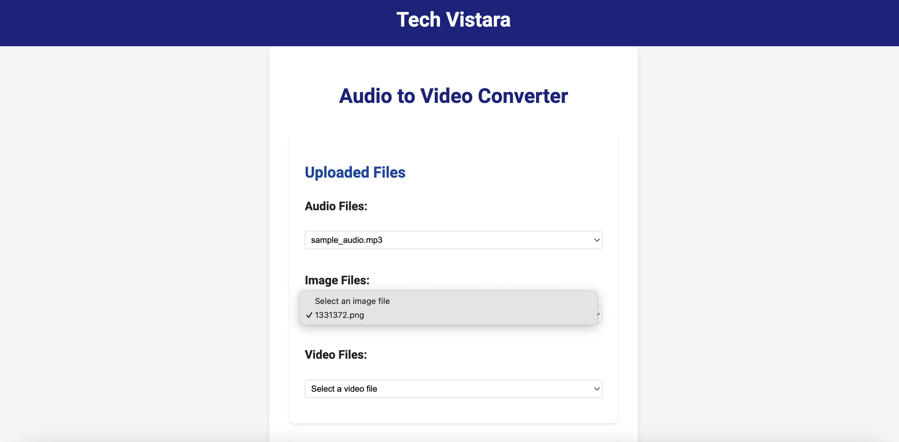
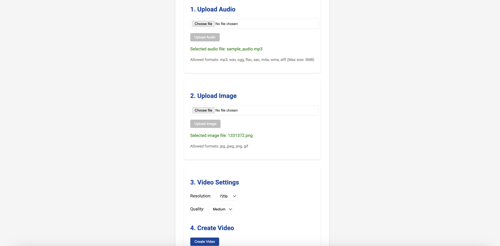
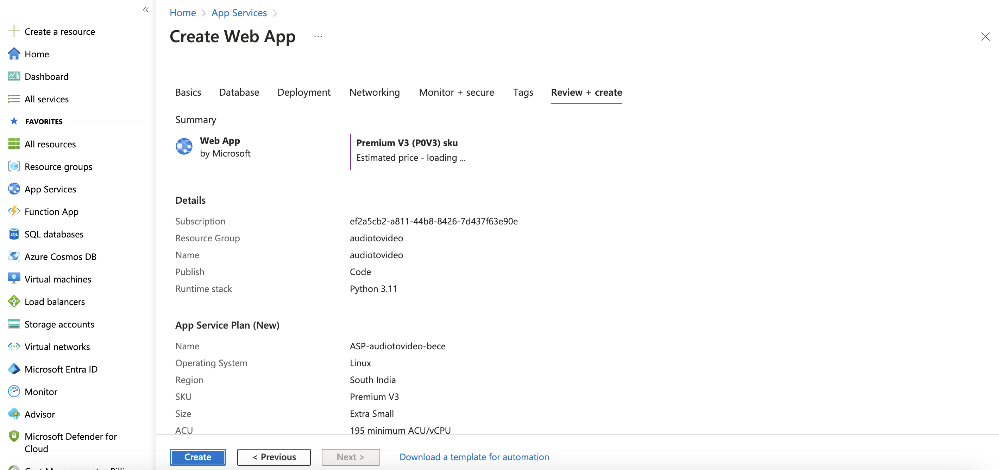

# Audio to Video Generation Tool 

### Final deployed Audio to Video webapp link : [Techvistaraconvertor](https://audiotovideo.azurewebsites.net/)

## With the help of Replit AI and deployed to Webapp 

- As there is currently a lot of audio content being released, such as Overview by NotebookLM from Google recently, building a tool to convert voice to a video format for uploading to certain video-only platforms is valuable.
- Naming this tool as :  **Techvistaraconvertor**.
- The link to try out the tool is provided at the top: [Techvistaraconvertor](https://audiotovideo.azurewebsites.net/)
- This exercise demonstrates that constant iteration and developing a solid framework for cloud deployment will give rise to many tools in the coming days of AI.
- [https://blog.google/technology/ai/notebooklm-audio-overviews/](https://blog.google/technology/ai/notebooklm-audio-overviews/)

## Initial Look of the Tool in Replit AI

* Using an audio file, in this case, we are using Google's NotebookLM downloaded audio.
* A custom image to appear on the video while playing.
* Generating the video with resolution selection.

## Replit Development interface 

## Working version 

* Enhanced the convertor to list the already available audio and images
* The instructions in setting up created by replit AI : [README.md](https://github.com/dinesh-coderepo/techvistaraconvertor/blob/main/README.md)

## Creating and linking Azure webapp to deploy the app

Code repo : [https://github.com/dinesh-coderepo/techvistaraconvertor](https://github.com/dinesh-coderepo/techvistaraconvertor)

- Linked the web app to the repo to enable CI/CD for incremental changes
- More details in the above code repo regarding the workflow deployment script: [Link](https://github.com/dinesh-coderepo/techvistaraconvertor/blob/main/.github/workflows/main_audiotovideo.yml)
- Deployed to the webapp: [https://audiotovideo.azurewebsites.net/](https://audiotovideo.azurewebsites.net/)

- The compute selected for the app service is very minimal hence we can expect resource crunch while video generation, but this exercise demonstrates building a tool for the need of a use case.

