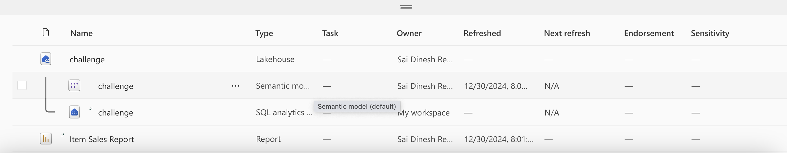

# Documenting Microsoft Learning challenge on fabric

### [Ignite Edition Challenge: Prepare for the next generation of data analytics with Microsoft Fabric](https://learn.microsoft.com/en-us/collections/8wy3ioj77zzgyd?sharingId=6A9F03F25E12DA9E&ref=collection&listId=d1z7cn7do0xpxr&wt.mc_id=ignitechallenge25_landingpage_wwl)

## Microsoft Fabric - Unified data analytics platform

#### Introduction to end-to-end analytics using Microsoft Fabric : [Link](https://learn.microsoft.com/en-us/collections/8wy3ioj77zzgyd?sharingId=6A9F03F25E12DA9E&ref=collection&listId=d1z7cn7do0xpxr&wt.mc_id=ignitechallenge25_landingpage_wwl)

Note : while I follow this challenge I will also create the resources in Azure and attach screenshots for better documentation.

### Azure fabric workspace: [https://app.fabric.microsoft.com/home](https://app.fabric.microsoft.com/home)

- Getting started with the intro module, fabric is a analytics platform with all the required services for data integrated to one service. It has services integrated to ingest, store, transform and analyze data all in one place. 
- Exciting for any member in data field having all in one place and managing it will be simpler than managing 4-5 different services in different places and permissions across services.
- Fabric has integrated data lake called onelake, OneCopy methodology seems to be key and looks like this paradigm will eliminate a separate copy(Costly Query Clusters) just for Product Managers to query data. [link](https://learn.microsoft.com/en-us/training/modules/introduction-end-analytics-use-microsoft-fabric/2-explore-analytics-fabric)
- One Lake is built on top of ADLS Azure. Data can be stored in all open formats like delta, parquet, csv, JSON. Meaning all services stores data in OneLake 
- In Onelake we can create shortcuts and point the data assets to other services , source data will always be in sync with other links.
- Workspaces - we can control resources and access controls on the workspaces and differentiate DEV UAT PROD env. 
- Workspace resources can be integrated to GIT and deploy, we can configure compute resources and other config details directly from ADO.
- Fabric brings together data ingestion and storage with OneLake, and for transformation we can use ADF and connect data ingested using DirectLake, easy integration to Power BI and much more.
-  we need an organizational email to create a trail account , process : [link](https://go.microsoft.com/fwlink/?linkid=2227864) , free trial restrictions and capabilities : [link](https://learn.microsoft.com/en-us/fabric/get-started/fabric-trial)


- Login to Azure fabric : [https://app.fabric.microsoft.com/home](https://app.fabric.microsoft.com/home) , you can provide access to other users even in trail account.
- By default onelake creates files in delta file format. Intro to fabric is module is now complete, on to the next module in this challenge. 


### Get started with lakehouses in Microsoft Fabric Module : [link](https://learn.microsoft.com/en-us/training/modules/get-started-lakehouses/)

- Foundation of Fabric is lakehouse built on top of onelake storage layer, good integration to compute engines for processing.
- lakehouse data is organized as schema on read, stores data by default as delta table format but supports all file formats. 
- Ingest data to lakehouse from many different sources and also there is a concept of shortcuts where we can link data from ADLS gen2 or some external sources directly.
- Access to lakehouse can be managed at workspace level or item-level sharing, item-level access is useful for granting read-only access for reporting or analytical needs.
- Lakehouse supports data governance features , sensitivity labels (microsoft purview). Transformation on ingested data can be done using spark or dataflows gen 2.
- For a new data lake house we create it creates three data items : lakehouse(which contains shortcuts,folders,files,tables) , Semantic model , SQL analytics endpoint (to allow read-only access to query data)
- To ingest data to lakehouse we have three options, upload data(local data) , Dataflow Gen2 (import and transform using power query) , Notebooks (will have access to pools) ,  Data Factory copy activity. We will have two options load to place files directly or load to tables.
- we can use custom JARS to create frameworks in spark and provide for custom implementations. - more info in the link : [spark-config](https://learn.microsoft.com/en-us/fabric/data-engineering/create-spark-job-definition)
- Fabric can access to shortcuts (data) directly from source systems( integrate data into your lakehouse while keeping it stored in external storage ) . While accessing the source data from fabric it uses the user credential to source systems for example we are accessing a storage to query(sql query end point), the user need to have read permissions in source system inorder to be able to read the data using the tool.  - more info on creating short cuts in lakehouse : [shortcuts](https://learn.microsoft.com/en-us/fabric/onelake/onelake-shortcuts)
- There are three mechanisms to ingest or transform data - notebooks (pyspark,scala, SQl), dataflow gen2( power query interface) , Pipelines to do Ingesting, transforming and loading. 
- The final enriched data can be accessed from notebooks (for ML development or analytical), using semantic model users can build power BI reports, also analysts can use SQL endpoint to query data.
- Doing the exercise on creating lakehouse in my trail account - [link](https://learn.microsoft.com/en-us/training/modules/get-started-lakehouses/5-exercise-lakehouse)
- Using visual tools for transformation and querying using sql pool, below attached few dashboard pics created on ingested sales data.
- Complete lab instructions : [lab-link](https://microsoftlearning.github.io/mslearn-fabric/Instructions/Labs/01-lakehouse.html#create-a-workspace)


- Final view of lakehouse in the workspace for the exercise.



- Completed this module , on to the next module ... 


### Use Apache Spark in Microsoft Fabric : [Link](https://learn.microsoft.com/en-us/training/modules/use-apache-spark-work-files-lakehouse/)

- In this module looking in to configuring spark in fabric, scenarios for spark jobs, utilizing spark df,sql and visualize data in spark notebooks.
- In fabric we have spark pools to compute and process data, the pools contains two kind of nodes - A head node which coordinated and distributes process through driver program. - worker nodes are where the distributed compute happens

- we will initially have starterpool but we can also create custom pool depending on our workload and compute needs.

- while creating a new pool, we have options to select either memory optimized pools or other (Node family). In node size we have small, medium, big pools to select from. It also has auto scale and dynamically allocate executor bars where we can select and provide the range. more details on custom spark pool : [link](https://learn.microsoft.com/en-us/fabric/data-engineering/create-custom-spark-pools)
-  we can have pools with multiple run times and import/install compatible libraries, we can select which env to run with a pool. runtime documentation : [link](https://learn.microsoft.com/en-us/fabric/data-engineering/runtime)
- we can create custom env with specifying spark version, check built-in functions , add public libraries and custom libraries, specify spark pool that env should use and over ride any default spark configurations , we can also upload resource files which are accessible in the env. more details : [link](https://learn.microsoft.com/en-us/fabric/data-engineering/create-and-use-environment)


- enable native execution engine in fabric for better performance on data stored in onelake (parquet and delta format) with below code blog -  more on this in the documentation [link](https://learn.microsoft.com/en-us/fabric/data-engineering/native-execution-engine-overview?tabs=sparksql)

```json

%%configure 
{ 
   "conf": {
       "spark.native.enabled": "true", 
       "spark.shuffle.manager": "org.apache.spark.shuffle.sort.ColumnarShuffleManager" 
   } 
}

```
- we can enable high concurrency to allow two concurrent users to utilize same session resources without over-riding  variables from two sessions, we also have MLFlow logging option to log model training and management operations for ML workloads and experiments.
- we have two modes to invoke a spark session, by notebook or a spark job. Use notebook mode to do interactive analysis or define a spark job to run a script on demand or on schedule. this option is available when clicked on new item in the workspace page.


- reading csv file to a spark df and doing more, 


#### Code blocks and all the data used here is sales data : [sales](https://raw.githubusercontent.com/MicrosoftLearning/dp-data/main/sales.csv)


```py
# running using pyspark
%%pyspark
df = spark.read.load('Files/data/sales.csv',
    format='csv',
    header=True
)
display(df.limit(10))

# running using scala
%%spark
val df = spark.read.format("csv").option("header", "true").load("Files/data/sales.csv")
display(df.limit(10))

# Defining schema for loading

from pyspark.sql.types import *
from pyspark.sql.functions import *

productSchema = StructType([
    StructField("SalesOrderNumber", StringType()),
    StructField("SalesOrderLineNumber", StringType()),
    StructField("OrderDate", StringType()),
    StructField("CustomerName", FloatType()),
    StructField("EmailAddress", StringType()),
    StructField("Item", StringType()),
    StructField("Quantity", StringType()),
    StructField("UnitPrice", StringType()),
    StructField("TaxAmount", StringType())
    ])

df = spark.read.load('Files/data/sales.csv',
    format='csv',
    schema=productSchema,
    header=False)
display(df.limit(10))

#Selecting required columns
pricelist_df = df.select("OrderDate", "EmailAddress")

# Filtering with some conditions
bikes_df = df.select("OrderDate", "EmailAddress", "UnitPrice").where((df["UnitPrice"]>=3200) & (df["OrderDate"] >= "2019-07-05") )

# Group by with aggregation sum
counts_df = df.select("OrderDate", "EmailAddress", "UnitPrice").groupBy("OrderDate").agg(sum("UnitPrice").alias("Total_Price"))
display(counts_df)

# Just getting group by with count
counts_df = df.select("OrderDate", "EmailAddress", "UnitPrice").groupBy("OrderDate").count()
display(counts_df)

# Writing to parquet
bikes_df.write.mode("overwrite").parquet('Files/data/bikes.parquet')

# Writing to a partition
bikes_df.write.partitionBy("OrderDate").mode("overwrite").parquet("Files/bike_data")

# Reading from a partition 
road_bikes_df = spark.read.parquet('Files/bike_data/OrderDate=2019-07-05')
display(road_bikes_df.limit(5))

# Observation from reading above command - not showing the partition column while reading

```


- spark sql, we can create the view from the df and then use spark sql to write queries, this is temp view only exists in the session. If we need to persist we can save as table.
- Microsoft fabrics preferred method of saving is delta format, the spark catalog support tables of various formats. we can also create external tables pointing data to external storage location, typically folder in lakehouse. Note : Deleting an external table doesn't delete the underlying data.
- We can apply partitioning on the delta tables and bucketing as well. we cal also %%sql magic command and execute sql.

```py
df.createOrReplaceTempView("sales_view")

# over writing the table
df.write.format("delta").mode('overwrite').saveAsTable("products")


df_products = spark.sql("SELECT * FROM challenge.products")
display(df_products.count())


#Partitioning the delta table for better performance

df.write.format("delta").mode("overwrite").partitionBy("OrderDate").saveAsTable("sales_partitioned")


sales_df = spark.sql("SELECT * \
                      FROM challenge.sales_partitioned ")
display(sales_df.count())


%%sql

SELECT OrderDate, COUNT(SalesOrderNumber) AS ProductCount
FROM sales_partitioned
GROUP BY OrderDate
ORDER BY OrderDate

```


- For plotting we can convert the df to pandas and use matplotlib , 

```py
from matplotlib import pyplot as plt

# Get the data as a Pandas dataframe
data = spark.sql("SELECT OrderDate, COUNT(SalesOrderNumber) AS ProductCount \
FROM sales_partitioned \
GROUP BY OrderDate \
ORDER BY OrderDate").toPandas()

# Clear the plot area
plt.clf()

# Create a Figure
fig = plt.figure(figsize=(12,8))

# Create a bar plot of product counts by category
plt.bar(x=data['OrderDate'], height=data['ProductCount'], color='orange')

# Customize the chart
plt.title('Product Counts by OrderDate')
plt.xlabel('OrderDate')
plt.ylabel('Products')
plt.grid(color='#95a5a6', linestyle='--', linewidth=2, axis='y', alpha=0.7)
plt.xticks(rotation=70)

# Show the plot area
plt.show()
```


- exercise to revise all concepts on spark df and charting : [link](https://microsoftlearning.github.io/mslearn-fabric/Instructions/Labs/02-analyze-spark.html)
- completed the module on to the next..


### Orchestrate processes and data movement with Microsoft Fabric : [link](https://learn.microsoft.com/en-us/training/modules/use-data-factory-pipelines-fabric/?username=saidineshreddymaluchuru-9386&section=activity)


- Data Pipelines in fabric - series of activities which copy/transform/load to onelake or other sources. we can schedule them and it is very similar to ADF in azure
- Core concepts in pipelines - activities which are kind of executable tasks and we can control the flow of pipeline from the final execution status of the activity and control the flow, in activities we have transformation activites (copy data from source , data flow to apply transformations ,we can also use notebooks to transform as we did in earlier module and provide destination to write to) 
- control flow activities to implement loops , conditional branching , manage variables and parameters. 
- more on the activities overview : [documentation](https://learn.microsoft.com/en-us/fabric/data-factory/activity-overview)
- Pipelines can be parametrized so that we can use this as a parameter in your activites (final saved folder name can be this parameter), each pipeline run creates a Unique run ID
- Copy data - mostly used activity to get the source data ingested, copy data good to directly connect to source get raw data, but if you have multiple sources and needs transformation before storing use Data Flow - [Documentation](https://learn.microsoft.com/en-us/training/modules/use-dataflow-gen-2-fabric/).


- there are already some pipeline templates to choose from in fabric , check and select the template that best suits your usecase to have a better starting point.
- You can see the pipeline execution history, run the pipelines. 


- exercise in this module : [link](https://microsoftlearning.github.io/mslearn-fabric/Instructions/Labs/04-ingest-pipeline.html)

- setting the http to read data from git sales csv and writing as files to lakehouse workspace. There is delete activity which we used to delete the in files/folders if any retention needs to be applied (wild card also supported). 
- we also can add notebooks directly to the pipeline to trigger.


```py
table_name = "sales_copy"

from pyspark.sql.functions import *

# Read the new sales data
df = spark.read.format("csv").option("header","true").load("Files/new_data/*.csv")

## Add month and year columns
df = df.withColumn("Year", year(col("OrderDate"))).withColumn("Month", month(col("OrderDate")))

# Derive FirstName and LastName columns
df = df.withColumn("FirstName", split(col("CustomerName"), " ").getItem(0)).withColumn("LastName", split(col("CustomerName"), " ").getItem(1))

# Filter and reorder columns
df = df["SalesOrderNumber", "SalesOrderLineNumber", "OrderDate", "Year", "Month", "FirstName", "LastName", "EmailAddress", "Item", "Quantity", "UnitPrice", "TaxAmount"]

# Load the data into a table
df.write.format("delta").mode("append").saveAsTable(table_name)

# Just checking some syntax
display(df.select(df_copy['OrderDate'],year(to_date(df_copy['OrderDate'],'yyyy-MM-dd'))))

```


- Completed this module, on to the next..


### Ingest Data with Dataflows Gen2 in Microsoft Fabric : [link](https://learn.microsoft.com/en-us/training/modules/use-dataflow-gen-2-fabric/?username=saidineshreddymaluchuru-9386&section=activity)

- In this module we will see : Dataflow capabilities in Microsoft Fabric, Dataflow solutions to ingest and transform data and Include a Dataflow in a pipeline
- data flow gen 2 used for executing ETL pipelines , allows to extract from different source, apply transformations and load to destination. we can add dataflow gen2 in to data pipeline activity if we choose to, destination is not compulsory in dataflow gen2.
- low code interface, reusability and provide self-serve user access to subset of data lakehouse.
- dataflow gen2 uses power query online to visualize transformations, we can create Dataflow Gen2 in DF workload, powerbi workspace or directly in lackhouse.
- It supports wide connectors to on-prem relational dbs, excel or flat files, shareporint, fabric lakehouses. some transformations which we can apply with this are obviously filter and sorting, pivot , unpivot, merge,append,split, conditional split, replace, reorder columns, ranking, top n etc.
- There is a concept called queries which persists as tables, once loaded to the data store we can reference this same data and split to dim and fact tables (star schema) or avoid it and disable this feature if not REQUIRED!!.
- Diagram view shows the pictorial representation with diff shapes for diff functions/transformations.
- data preview pane lets you see a subset of data with transformations applied. Query settings pane shows the M code backend of the visuals. You can also set a data destination to lakehouse, warehouse,dql db.
- Power Query Documentation - [link](https://learn.microsoft.com/en-us/power-query/)
- We can combine dataflow gen2 and pipelines to have additional operations on transformed data. and to orchestrate it we need to use pipelines to trigger the dataflow gen2.
- Exercise - [link](https://microsoftlearning.github.io/mslearn-fabric/Instructions/Labs/05-dataflows-gen2.html)
- Raw data using for the exercise : [sales.csv](https://raw.githubusercontent.com/dinesh-coderepo/dp-data/refs/heads/main/orders.csv)
- Import the above data by selecting import Text/CSV and give URL, add custom column and give logic (in this case extracting month), add destination to your lakehouse (append or replace options)


- we can add the dataflow created by adding a dataflow activity to the pipeline and tag to the already created dataflow gen2 flow to the activity settings of dataflow. Provide the destination to the lakehouse as append type or replace to directly load to the table.


- Data factory in fabric documentation to learn more : [link](https://learn.microsoft.com/en-us/fabric/data-factory/), finally completed this module.


### Get started with data warehouses in Microsoft Fabric : [link](https://learn.microsoft.com/en-us/training/modules/get-started-data-warehouse/?sharingId=6A9F03F25E12DA9E&ref=collection&listId=d1z7cn7do0xpxr&wt.mc_id=ignitechallenge25_landingpage_wwl)

- Official documentation on data warehouses in fabric : [link](https://learn.microsoft.com/en-us/fabric/data-warehouse/data-warehousing)
- Data warehouses are analytical stores built on a relational schema to support SQL queries, in this module we have describe what is data warehouses in fabric, data warehouse vs lakehouse, working with data warehouse, manage fact and dim tables in data warehouse. Seems to be a important module in fabric as this is where the enriched data layers are defined.
- Data warehouse in fabric is designed for more structured relational type data ingestion, dim and fact. Supports T-SQL to query and transform similar to a relational storage, its like a relational layer ontop of lakehouse.
- Other than the key - key relationship in star schema between fact and dim (business key), there seems to be a surrogate key(kind of index) to maintain consistency?
- There are special type of dimension tables to provide additional context? : time dimensions provide event occurred during time periods , SCD(slowly changing dimensions) are dimension tables that track changes to dimension attributes overtime?
- [star schema](https://learn.microsoft.com/en-us/power-bi/guidance/star-schema), most transactional dbs tables are normally normalized to reduce duplications. In data warehouses tables are de-normed to avoid joins while querying data. 


- General process to implement a dw solution, ingest data to data lake, load data from these files present in data lake to staging tables, upsert to dim and fact , do the post-load optimizations as updating indexing and distribution stats. 
- If we just need to query data on top of data lake, we can do so with out duplicating it to data warehouse, but by directly querying from lakehouse by cross-database querying.


- we can use t-sql in query editor from the browser to run DML and DDL commands, create views, tables. Also these is a low code ETL visual query editor where we can apply transformations. 
- We have datamodel view and building relations between tables. we can also create measures(similar to calculated fields in power BI - DAX) , Data Analysis Expressions (DAX) formula language. 
- New tables in the Lakehouse are automatically added to the default semantic model, semantic model allows to query the dw content externally by BAs. Also we can create reports on query results or create new reports on dw tables directly.
- there are different roles and security while querying and storing data in fabric, we have workspace permissions and item permissions . workspace permissions provide access throughout the workspace contents. with item permissions we can provide access to individual warehouses in workspace and Read (sql endpoint connection), ReadData (allows user to query any table), ReadAll(able to read files in onelake using spark?)
- Monitoring tools provide frameworks to identify query metrics, anomalies. also Kill the queries if the query is consuming lot of resources.
    - sys.dm_exec_connections: Returns information about each connection established between the warehouse and the engine.
    - sys.dm_exec_sessions: Returns information about each session authenticated between the item and engine.
    - sys.dm_exec_requests: Returns information about each active request in a session.
- Data warehouse exercise : [Link](https://microsoftlearning.github.io/mslearn-fabric/Instructions/Labs/06-data-warehouse.html)


### Load data into a Microsoft Fabric data warehouse : [link](https://learn.microsoft.com/en-us/training/modules/load-data-into-microsoft-fabric-data-warehouse/?sharingId=6A9F03F25E12DA9E&ref=collection&listId=d1z7cn7do0xpxr&wt.mc_id=ignitechallenge25_landingpage_wwl)

- In this modules, strategies to load data into fabric, data pipelines, loading data using T-SQL, load and transform using dataflow gen2.


- Microsoft Fabric is centered around a single data lake. data in fabric is stored in parquet files in data lake and between different services the data can be shared without copying for etl/analysis.
- data load strategies in to dw in fabric, staging your data , staging need not be loading data into the internal storage but could be external as well. It serves to optimize resources and avoid throttling. Full load/incremental loading mechanisms. More on incremental loading : [link](https://learn.microsoft.com/en-us/fabric/data-factory/tutorial-incremental-copy-data-warehouse-lakehouse)


- dimension tables - attributes with details or characteristics. the changes of these dimension tables can be characterized to SCD - slowly changing dimensions with below defs(picked as is from module)
    - Type 0 SCD: The dimension attributes never change.
    - Type 1 SCD: Overwrites existing data, doesn't keep history.
    - Type 2 SCD: Adds new records for changes, keeps full history for a given natural key.
    - Type 3 SCD: History is added as a new column.
    - Type 4 SCD: A new dimension is added.
    - Type 5 SCD: When certain attributes of a large dimension change over time, but using type 2 isn't feasible due to the dimension’s large size.
    - Type 6 SCD: Combination of type 2 and type 3.
- scd type 2 example below where the latest record is set to active. we have insert, update, create procedures
```sql
IF EXISTS (SELECT 1 FROM Dim_Products WHERE SourceKey = @ProductID AND IsActive = 'True')
BEGIN
    -- Existing product record
    UPDATE Dim_Products
    SET ValidTo = GETDATE(), IsActive = 'False'
    WHERE SourceKey = @ProductID 
        AND IsActive = 'True';
END
ELSE
BEGIN
    -- New product record
    INSERT INTO Dim_Products (SourceKey, ProductName, StartDate, EndDate, IsActive)
    VALUES (@ProductID, @ProductName, GETDATE(), '9999-12-31', 'True');
END
```


- first we normally load the dim tables so if fact references the dim it will be already present. data pipelines to load data in warehouse, All data in a Warehouse is automatically stored in the Delta Parquet format in OneLake. 
- ingesting using data pipelines - [link](https://learn.microsoft.com/en-us/fabric/data-warehouse/ingest-data-pipelines)
- there seems to be datatype enforcement while loading the data to the schema, and looks like I can not change the datatype in pipeline once the copy stage is established. I need to remove and recreate the stage again. Keeping varchar is better for raw layer.

```
ErrorCode=DWCopyCommandOperationFailed,'Type=Microsoft.DataTransfer.Common.Shared.HybridDeliveryException,Message='DataWarehouse' Copy Command operation failed with error ''Column 'TaxAmount' of type 'REAL' is not compatible with external data type 'Parquet physical type: BYTE_ARRAY, logical type: UTF8', please try with 'VARCHAR(8000)'. Underlying data description: file 'https://olspn5q0h1kvg2htgcb6p.dfs.core.windows.net/93ba4f12-bd72-422f-b6f8-869e5ee2c177/_system/services/DI/pipelines/6906c723-8f93-4afa-a121-4ab78f070661/MSSQLImportCommand/6f2ec288-dfaa-450b-ad61-5fb9b4f90c79.parquet'.
```


- we can also load data using t-sql, copy command loads data to the table from sources,we can provide arguments to store rejected rows, skip header etc while copying(The COPY statement currently supports the PARQUET and CSV file formats.)
- we can also load data using data flow gen2, keeping gifs from module here for reference.


- exercise for loading data in to dw using t-sql : [link](https://microsoftlearning.github.io/mslearn-fabric/Instructions/Labs/06a-data-warehouse-load.html)


### Secure a Microsoft Fabric data warehouse : [link](https://learn.microsoft.com/en-us/training/modules/secure-data-warehouse-in-microsoft-fabric/?sharingId=6A9F03F25E12DA9E&ref=collection&listId=d1z7cn7do0xpxr&wt.mc_id=ignitechallenge25_landingpage_wwl)

- in this module, secure data in fabric, implementing dynamic data masking to mask sensitive info, row-level security for granular control, column-level security to protect sensitive data, granular permissions using t-sql
- security is very important in the current world of data, many orgs have to secure the access and permissions for data audit purposes, 
- 

### continued...