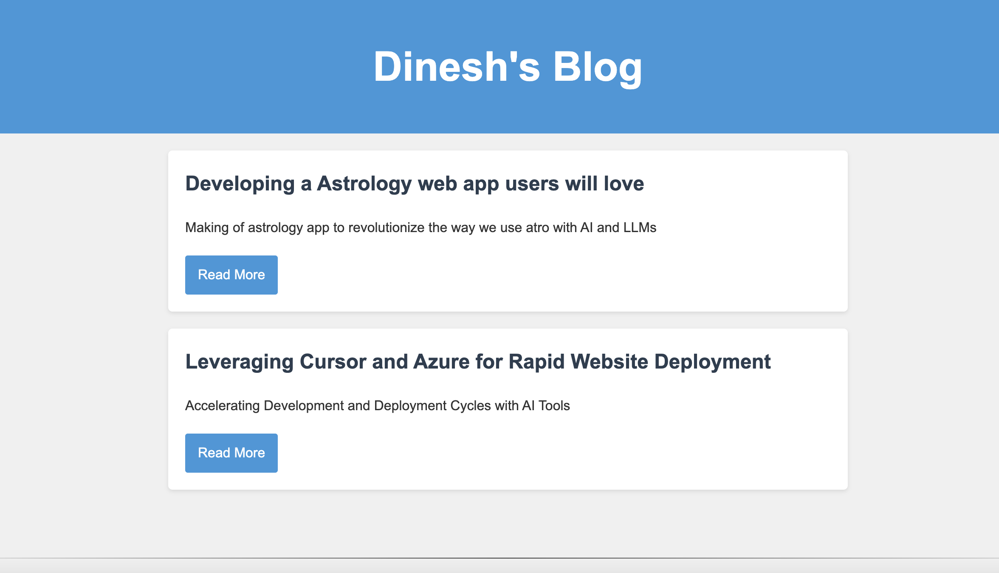
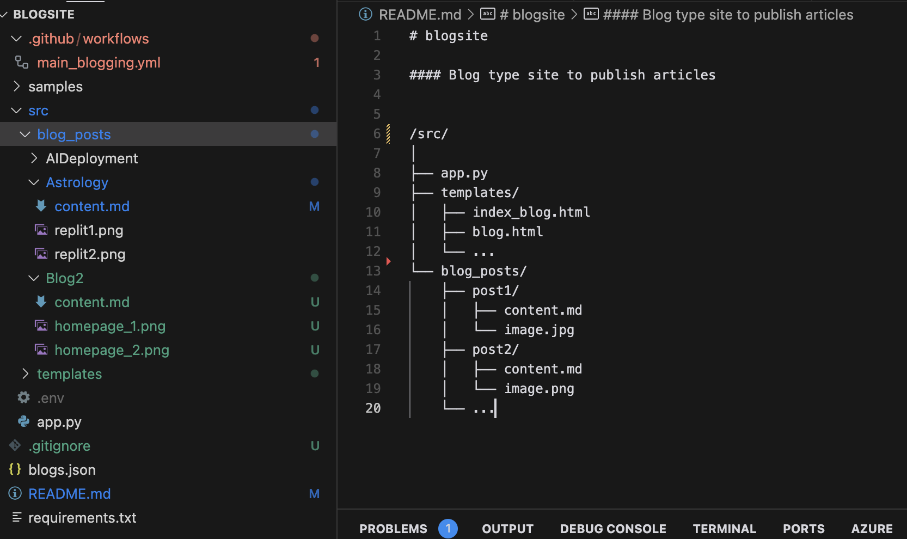

# Improving and enhancing the UI of this blogging app with the same functionalities.

## Current UI funtionalities and experiance

- 1.**Home Page:**

Simple layout with blogs sorted with date parameter passed in content.md file.

- 2.**Blog Page:**

The blogs are direct implementation of markdown coverted to html using `md.covert`. The converstion and testing is already done is running as expected (parsing impages, bloding, headers formating, links embedding ) so the parsing is working as expected. The incremental blogging will be done with blogging by creating a folder in blogpposts and writing down markdown files with content.md and other assets.

[https://www.markdownguide.org/basic-syntax/](https://www.markdownguide.org/basic-syntax/)

- 3.**Blogging input method:**

Version1 branch with all the code until this implementation so that we can revert to this version in future if needed.

[https://github.com/dinesh-coderepo/blogsite/tree/version1](https://github.com/dinesh-coderepo/blogsite/tree/version1)

As mentioned already the input method is markdown by creating a folder for each blog and adding content.md with the content and other assets.

