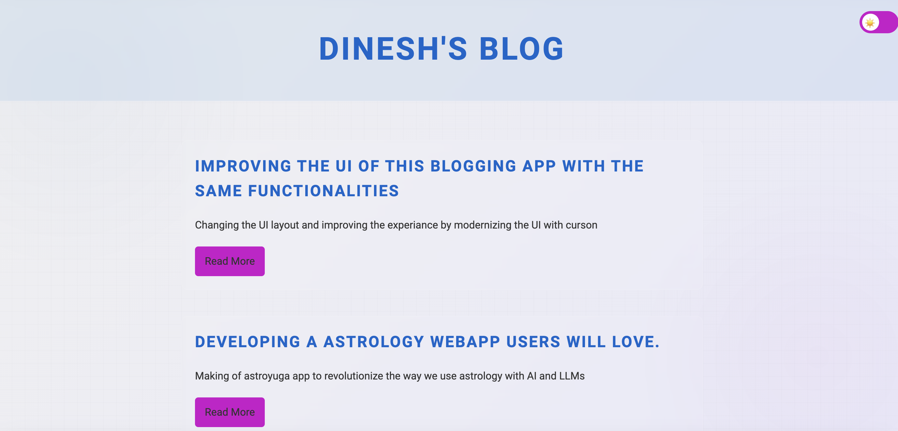

# Improving and Enhancing the UI of this blogging app with the same functionalities.

## Current UI functionalities and experience

- 1.**Home Page:**

Simple layout with blogs sorted with date parameter passed in content.md file.

- 2.**Blog Page:**

The blogs are direct implementation of markdown converted to html using `md.convert`. The conversion and testing is already done and running as expected (parsing images, bolding, headers formatting, links embedding) so the parsing is working as expected. The incremental blogging will be done by creating a folder in blogposts and writing down markdown files with content.md and other assets.

[https://www.markdownguide.org/basic-syntax/](https://www.markdownguide.org/basic-syntax/)

- 3.**Blogging input method:**

Version1 branch with all the code until this implementation so that we can revert to this version in future if needed.

[https://github.com/dinesh-coderepo/blogsite/tree/version1](https://github.com/dinesh-coderepo/blogsite/tree/version1)

As mentioned already the input method is markdown by creating a folder for each blog and adding content.md with the content and other assets.

- 4 .**Made changes to the UI using cursor:**

All the changes are made using cursor prompts, the below is the summary of all the changes I asked the cursor to do to enhance the UI, additionally integrated the light and dark modes to the blog site. 

- Note:
        - Cursor made many mistakes while implementing the toggle feature.
        - Consistency was missed between pages on which side the slider would be on each page. This solution required many iterations with cursor prompts to get right.
        - Always assume you will never reach 100% of what you want with the prompts, so having domain knowledge of these technologies is still important if you do not want to compromise on implementation.
        - For my blog, the achieved format looks good for the second version. I will keep iterating the blog to newer versions and add functionalities as well going forward.

Summarizing the changes made to the UI:

- Implemented a consistent dark/light mode toggle across all pages:

    - Added a sliding toggle switch with sun (light mode) and moon (dark mode) icons.
    - Ensured the toggle works consistently across blog index, individual blog posts, translator input, and translator results pages.
    - Implemented local storage to remember user's preference.

2. Redesigned the background for a more fluid and visually appealing look:
    - Created a gradient background that transitions smoothly from dark to a slightly lighter shade.
    - Added subtle radial gradients and a fine grid pattern for depth and texture.
    - Implemented a glassmorphism effect for containers and blog posts, with blur effects and slight transparency.

3. Improved the blog index page (index_blog.html):
    - Enhanced the layout with better spacing between elements.
    - Added differentiation between blog posts using CSS Grid with gaps.
    - Styled each blog post with its own container, subtle background, and hover effects.
    - Positioned the translator section at the bottom with proper styling and separation.

4. Updated the individual blog page (blog.html):
    - Maintained consistency with the index page styling.
    - Improved readability of blog content with proper spacing and formatting.

5. Enhanced the translator pages (index_translator.html and results_translator.html):
    - Aligned the styling with the blog pages for a consistent look.
    - Improved button styling and layout.
    - Added a "Go to Home" button on the results page for better navigation.

6. Implemented responsive design:
    - Ensured the layout adapts well to different screen sizes.
    - Used max-width for containers to improve readability on larger screens.

7. Typography and color improvements:
    - Used the Roboto font family for a modern, clean look.
    - Implemented a color scheme with primary and accent colors that work well in both dark and light modes.

8. Added subtle animations and transitions:
    - Implemented hover effects on buttons and blog post containers.
    - Added smooth transitions for color changes when switching between dark and light modes.

These UI changes have significantly improved the overall look and feel of the blogging app while maintaining its core functionalities. The new design provides a more modern, cohesive, and user-friendly experience across all pages of the website.

