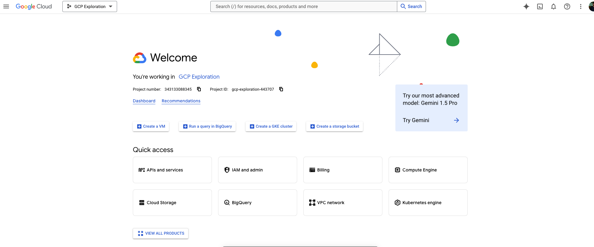
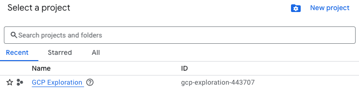
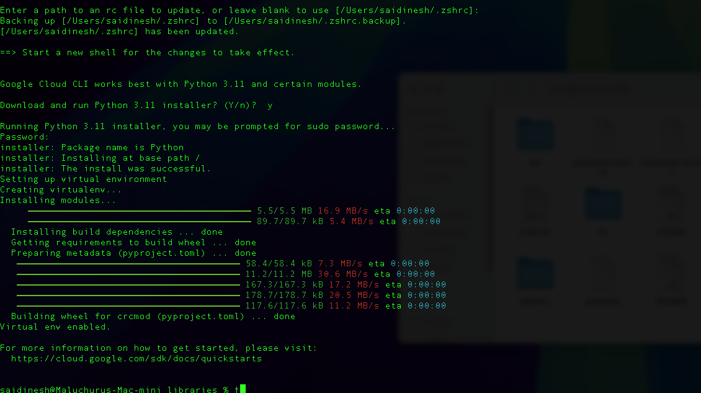
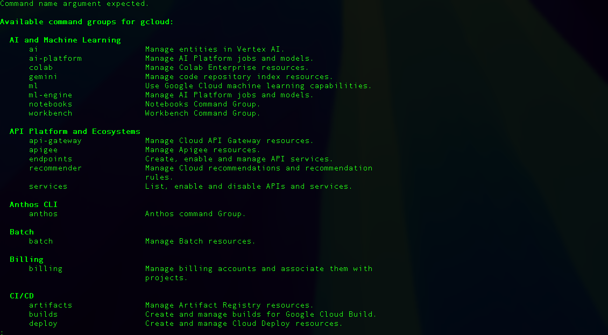
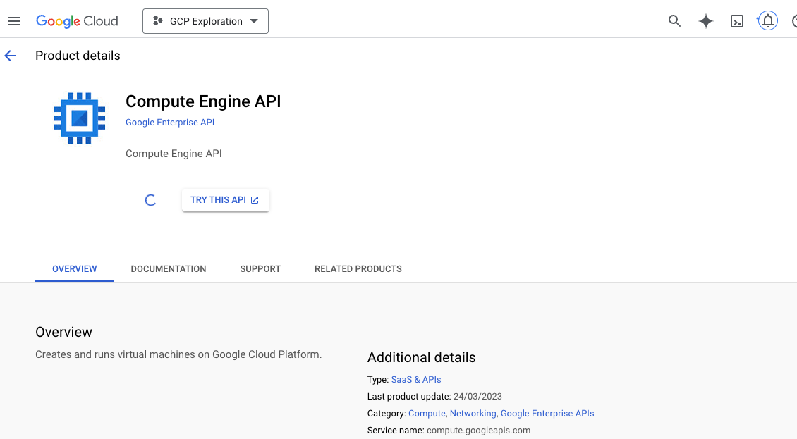
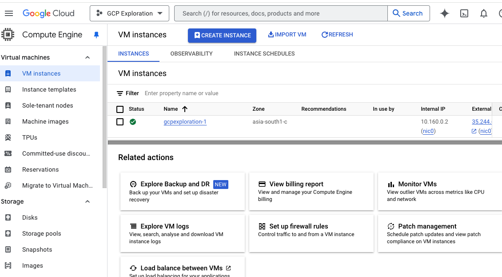
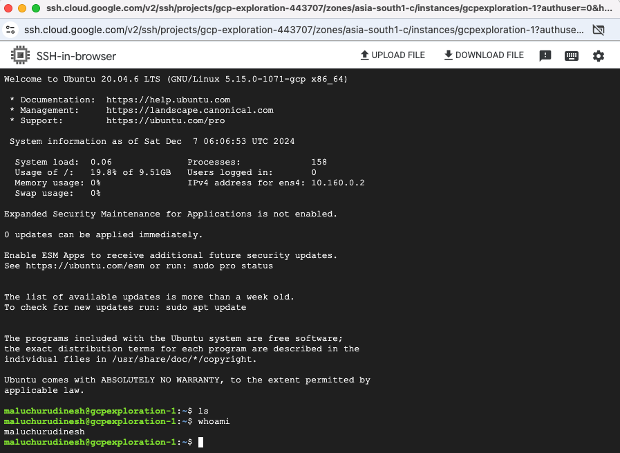
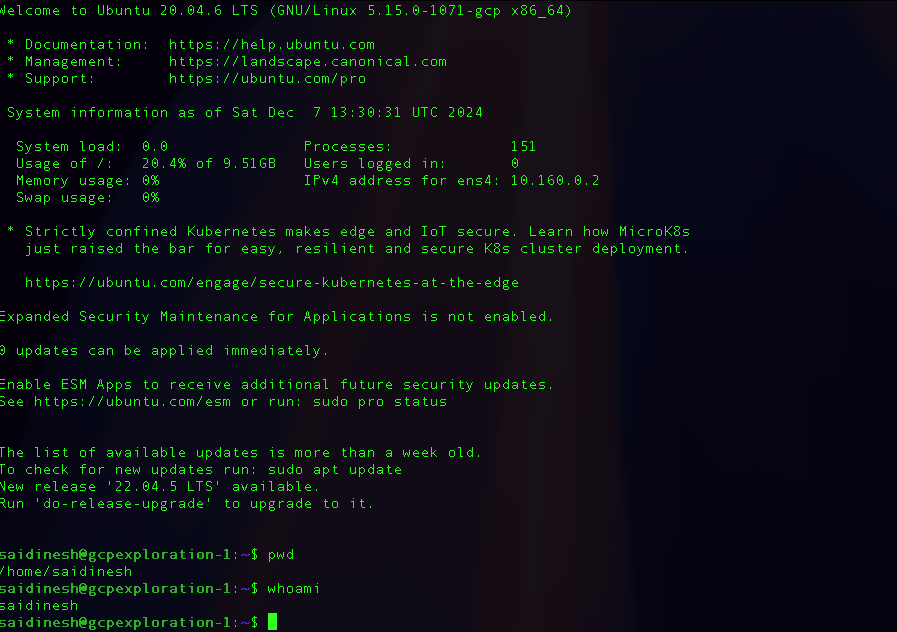
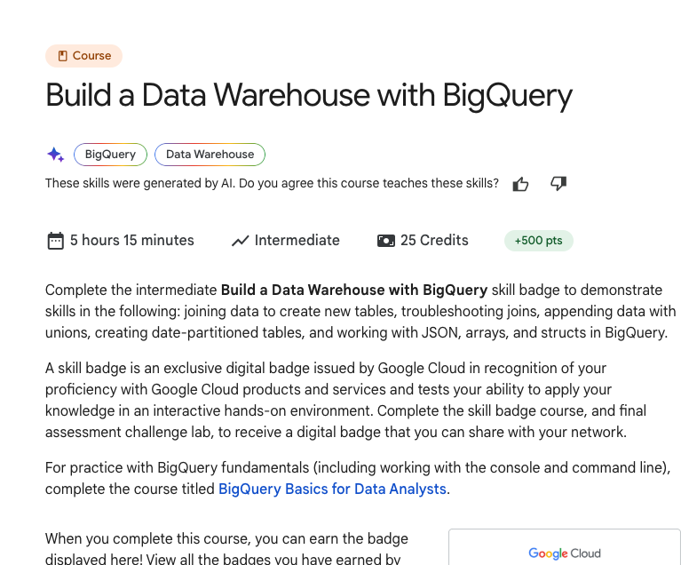

# GCP Services for ML Engineering and Data Engineering



#### Documenting in Notion : [link](https://blushing-drink-f49.notion.site/GCP-Learning-Basics-154f681975c780dc9e6af2fa316b945a?pvs=4) for easy updatability. I will copy from notion to blog in regular intervals.  

## Following is the plan to explore the services and read documentations on the services

### Google Cloud Learning Resources Roadmap provided by Claude AI - Planned using the Claude Haiku LLM to give me resources and plan to explore GCP in short period of time.

## Rapid Plan to explore and familiarize GCP services and technologies.

## Cloud Fundamentals & Data Engineering Resources

### Cloud Console & Infrastructure Setup
- **Official Setup Guide**: [Cloud Resource Manager](https://cloud.google.com/resource-manager/docs/creating-managing-projects)
- **Free Credits**: [Google Cloud Free Tier](https://cloud.google.com/free)
- **SDK Installation**: [Google Cloud SDK Install](https://cloud.google.com/sdk/docs/install)

### Cloud Fundamentals & Networking
- **Compute Engine Tutorial**: [Quickstart Linux](https://cloud.google.com/compute/docs/quickstart-linux)
- **Networking Guide**: [VPC Overview](https://cloud.google.com/vpc/docs/overview)
- **IAM Documentation**: [Identity Management Quickstart](https://cloud.google.com/iam/docs/quickstart)

### Data Engineering Foundations
- **BigQuery Quickstart**: [BigQuery Basics](https://cloud.google.com/bigquery/docs/quickstarts)
- **SQL Tutorial**: [BigQuery SQL Guide](https://cloud.google.com/bigquery/docs/tutorials)
- **Cloud Storage Guide**: [Storage Quickstart](https://cloud.google.com/storage/docs/quickstart-console)

### Advanced Data Engineering
- **Dataflow Tutorial**: [Dataflow Quickstarts](https://cloud.google.com/dataflow/docs/quickstarts)
- **Apache Beam Guide**: [Getting Started](https://beam.apache.org/get-started/quickstart-py/)
- **Data Processing Examples**: [Dataflow Samples](https://github.com/GoogleCloudPlatform/dataflow-samples)

### Machine Learning Infrastructure
- **Vertex AI Overview**: [Getting Started](https://cloud.google.com/vertex-ai/docs/start)
- **AutoML Tutorial**: [AutoML Quickstart](https://cloud.google.com/automl/docs/quickstart)
- **GPU Setup Guide**: [GPU Configuration](https://cloud.google.com/compute/docs/gpus/setup-gpus)

### Practical ML Project Resources
- **TensorFlow Tutorials**: [Official Tutorials](https://www.tensorflow.org/tutorials)
- **Kaggle Datasets**: [Machine Learning Datasets](https://www.kaggle.com/datasets)
- **Google Colab**: [Online Notebook Environment](https://colab.research.google.com/)

## Deep Learning & Advanced Implementations

### Deep Learning Foundations
- **PyTorch Tutorials**: [Official Tutorials](https://pytorch.org/tutorials/)
- **TensorFlow Learn**: [Learning Resources](https://www.tensorflow.org/learn)
- **Transfer Learning Guide**: [Image Transfer Learning](https://www.tensorflow.org/tutorials/images/transfer_learning)

### Practical Deep Learning
- **Image Classification Tutorial**: [TensorFlow Classification](https://www.tensorflow.org/tutorials/images/classification)
- **Keras Model Training**: [Training Methods](https://keras.io/guides/training_with_built_in_methods/)
- **Hyperparameter Optimization**: [Vertex AI Tuning](https://cloud.google.com/vertex-ai/docs/training/hyperparameter-tuning-overview)

### Advanced ML Techniques
- **MLOps Principles**: [Continuous Delivery Pipelines](https://cloud.google.com/architecture/mlops-continuous-delivery-and-automation-pipelines-in-machine-learning)
- **Model Monitoring**: [Vertex AI Monitoring](https://cloud.google.com/vertex-ai/docs/model-monitoring/overview)
- **Deployment Strategies**: [Model Prediction Deployment](https://cloud.google.com/vertex-ai/docs/predictions/deploy-model)

### Real-world Project Resources
- **Churn Prediction Tutorial**: [Customer Churn ML](https://cloud.google.com/solutions/machine-learning/predicting-customer-churn-tutorial)
- **Feature Engineering**: [Structured Data Features](https://www.tensorflow.org/tutorials/structured_data/feature_columns)

### Cloud Cost Optimization
- **Cost Management**: [Google Cloud Cost Tools](https://cloud.google.com/cost-management)
- **Pricing Calculator**: [Cloud Pricing Estimator](https://cloud.google.com/products/calculator)
- **Resource Optimization**: [Cloud Recommender](https://cloud.google.com/recommender/docs/optimize-cost)

### Project Documentation & Performance
- **Documentation Template**: [Cloud Documentation](https://cloud.google.com/docs/templates)
- **Performance Metrics Guide**: [Cloud Monitoring](https://cloud.google.com/monitoring/docs/monitoring_overview)

## Additional Comprehensive Learning Resources
- [Google Cloud Skills Boost](https://www.cloudskillsboost.google/)
- [Coursera Google Cloud Path](https://www.coursera.org/googlecloud)
- [GitHub Learning Repositories](https://github.com/GoogleCloudPlatform/)

## 🚀 Pro Learning Tips

1. **Parallel Learning**
   - Open multiple browser tabs for comprehensive resource exploration
   - Create a structured learning environment

2. **Active Learning Techniques**
   - Take detailed, structured notes for each resource
   - Screenshot key configurations and code snippets
   - Create a personal knowledge repository

3. **Practical Implementation**
   - Practice immediate implementation of learned concepts
   - Build small projects to reinforce understanding
   - Experiment with different cloud services and tools

### Recommended Learning Approach

- **Focus on Hands-on Experience**: 60% practical work
- **Theoretical Understanding**: 30% documentation and tutorials
- **Reflection and Documentation**: 10% summarizing and noting learnings


### After learning all these services , need to build a product. 

- Asked Claude AI to provide beginner friendly projects to implement in GCP, among the [list](https://docs.google.com/document/d/1RSZwQISUoS2VAbqGoP7Y0M6oXwf49_TrW99pd0uplkY/edit?usp=sharing) selected below project.

### Weather Data Analysis Dashboard

### Complexity: Beginner

### Key GCP Services:

- Cloud Functions
- BigQuery
- Data Studio

**Project Features:**

- Fetch weather data from public APIs
- Store historical weather information
- Create simple visualizations
- Basic predictive analysis


## Implementation of the plan :

## Cloud Fundamentals & Data Engineering Resources :

### Setting up :

### Project setup and google SDK installation


## Cloud Console & Infrastructure Setup

### **Official Setup Guide**: [Cloud Resource Manager](https://cloud.google.com/resource-manager/docs/creating-managing-projects)

Project Name : GCP Exploration

Project ID : gcp-exploration-443707

Manually created the project



### **Free Credits**: [Google Cloud Free Tier](https://cloud.google.com/free)

Currently have free credits to utilise and use for bigger projects with longer expiry for credits, all thanks to Google GCP team, also there are thresholds for unlimited free tier like e2-micro machine and storage upto 5gb etc. The detailed usage limit for different services are listed in the link.

### **SDK Installation**: [Google Cloud SDK Install](https://cloud.google.com/sdk/docs/install)

- Downloaded and installed the google sdk in local machine

| macOS 64-bit(ARM64, Apple M1 silicon) | [google-cloud-cli-darwin-arm.tar.gz](https://dl.google.com/dl/cloudsdk/channels/rapid/downloads/google-cloud-cli-darwin-arm.tar.gz) | 53.9 MB | d986d0c6531be038b71218f8e7e666c5b4d18ef580d6a063550406ed07e460f9 |
| --- | --- | --- | --- |

- Installed the SDK and added to the path



- Running the glcoud command locally




## **Cloud Fundamentals & Networking**

### **Compute Engine Tutorial**: [Quickstart Linux](https://cloud.google.com/compute/docs/quickstart-linux)

#### Enabling the Compute engine API

https://console.cloud.google.com/apis/library/compute.googleapis.com?inv=1&invt=Abja6A&project=gcp-exploration-443707



#### Creating a Linux VM in GCP

- Project and Compute Engine API needs to be created and enabled
- Creating a basic E2 series - High Memory - 8 vCPU, 4 core, 64 GB Memory machine
- Modified the OS to Ubuntu Linux - 20.04 LTS , region - Mumbai , name : gcpexploration-1
- Firewall - Enabled all HTTP, HTTPS , Load Balancer checks



- SSH to the VM via web interface



- Connecting to the created VM from local

- To authenticate the session locally, run below command in your terminal and sign in with your GCP account

```bash
gcloud auth login

gcloud compute ssh --zone "asia-south1-c" "gcpexploration-1" --project "gcp-exploration-443707"
```

#### Connected to VM via local terminal




### **Networking Guide**: [VPC Overview](https://cloud.google.com/vpc/docs/overview)

- Virtual private cloud is a managed networking service for our services to securely communicate with eachother
- we can isolate the network or configure with custom definitions.
- These networks are global in nature so any one VPC can be multi region
- In VPC we have subnets, these are regional so we can isolate resources within specific region.
- Subnets further divides VPC in to smaller segments and we can allocate specific IP addresses to a specific region.
- Subnets support both Public IPs or Private IP addresses.
- Routing - Normally VPCs have default routes to connect resources each other in same VPC or to the internet.
- Routes tell VM instances and the VPC network how to send traffic from an instance to a destination, either inside the network or outside of Google Cloud.
- We can also create custom routes for advanced network designs.
- Firewall rules - Built-in firewall rules allow you to control the traffic to and from the resources in the VPC.
- VPC Peering - Enables private communication between two VPC networks
- Forwarding rules - While routes govern traffic leaving an instance, forwarding rules direct traffic to a Google Cloud resource in a VPC network based on IP address, protocol, and port.
- Alias IP ranges - multiple services running on a single VM instance, you can give each service a different internal IP address by using alias IP ranges , VPC network then routes to specific service.


### **IAM Documentation**: [Identity Management Quickstart](https://cloud.google.com/iam/docs/quickstart)

- Mainly used to manage access to resources, allows to control the permissions of users, groups , service accounts.
- IAM for organizations useful for auditing purposes to manage access , monitor activity and grant right access to right people.
- Identity in IAM represents a user or system that requires access to GCP resources 
   - Accounts - Individuals
   - Service Accounts - Used by applications or Services
   - Groups 
   - Federated Identities - External identities (from another identity provider) mapped to GCP
- Roles define what actions can be performed on specific GCP resources
   - Basic roles like Owner , Editor and Viewer
   - Predefined roles - Roles defined to managed specific tasks or resources like roles for managing Cloud storage or Compute
   - Custom roles - User defined with custom permissions
- Permissions specify what actions are allowed on resources.
- Policies are bindings that associate identities with roles, defining access permissions.


#### Note : Free credits provided are exhausted, now I will be continuing to explore using the [https://www.cloudskillsboost.google/](https://www.cloudskillsboost.google/)

### BigQuery Quickstart

- Starting the Build a Data Warehouse with BigQuery course for this section
- Course link : [google skill](https://www.cloudskillsboost.google/course_templates/624)
- Completing this will provide in-depth knowledge on BigQuery
- Course also contains hands-on labs




#### Also documenting in Notion : [link](https://blushing-drink-f49.notion.site/GCP-Learning-Basics-154f681975c780dc9e6af2fa316b945a?pvs=4). 
