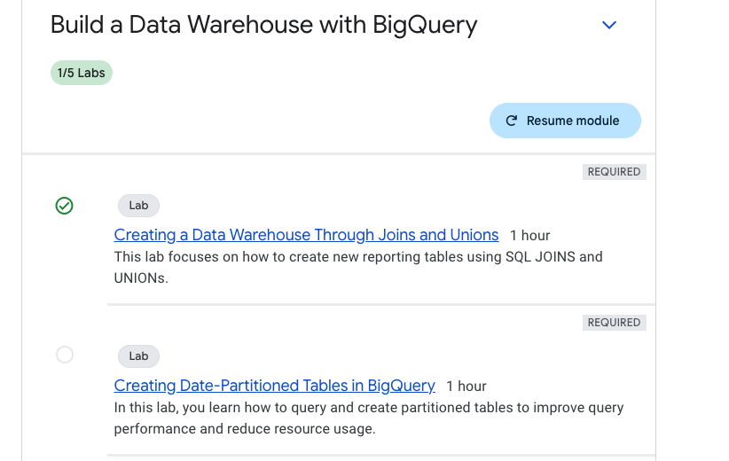
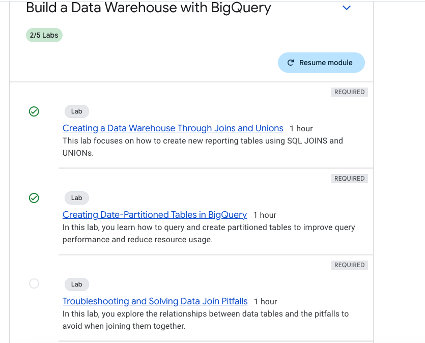
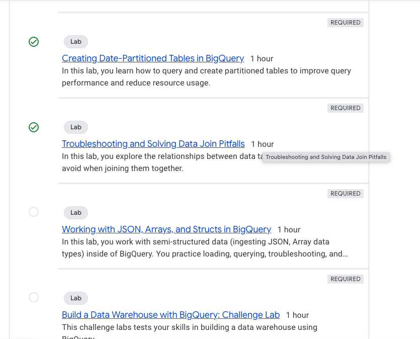
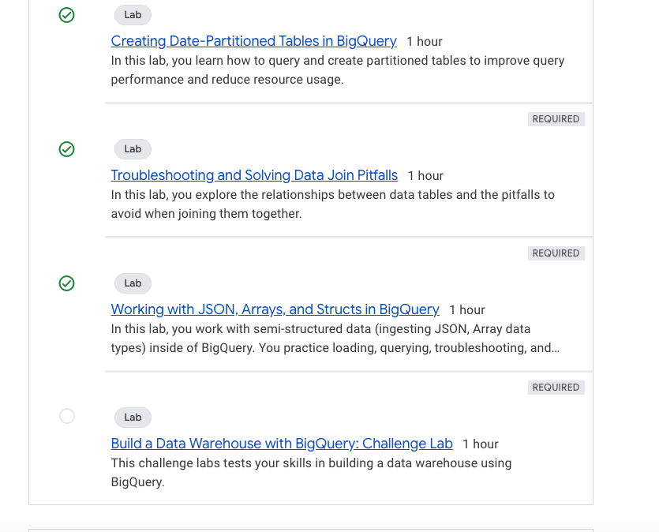

# GCP Services for ML Engineering and Data Engineering


#### Documenting in Notion : [link](https://blushing-drink-f49.notion.site/GCP-Learning-Basics-154f681975c780dc9e6af2fa316b945a?pvs=4) for easy updatability. I will copy from notion to blog in regular intervals.  

## Following is the plan to explore the services and read documentations on the services

### Google Cloud Learning Resources Roadmap provided by Claude AI - Planned using the Claude Haiku LLM to give me resources and plan to explore GCP in short period of time.

## Rapid Plan to explore and familiarize GCP services and technologies.

## Cloud Fundamentals & Data Engineering Resources

### Cloud Console & Infrastructure Setup
- **Official Setup Guide**: [Cloud Resource Manager](https://cloud.google.com/resource-manager/docs/creating-managing-projects)
- **Free Credits**: [Google Cloud Free Tier](https://cloud.google.com/free)
- **SDK Installation**: [Google Cloud SDK Install](https://cloud.google.com/sdk/docs/install)

### Cloud Fundamentals & Networking
- **Compute Engine Tutorial**: [Quickstart Linux](https://cloud.google.com/compute/docs/quickstart-linux)
- **Networking Guide**: [VPC Overview](https://cloud.google.com/vpc/docs/overview)
- **IAM Documentation**: [Identity Management Quickstart](https://cloud.google.com/iam/docs/quickstart)

### Data Engineering Foundations
- **BigQuery Quickstart**: [BigQuery Basics](https://cloud.google.com/bigquery/docs/quickstarts)
- **SQL Tutorial**: [BigQuery SQL Guide](https://cloud.google.com/bigquery/docs/tutorials)
- **Cloud Storage Guide**: [Storage Quickstart](https://cloud.google.com/storage/docs/quickstart-console)

### Advanced Data Engineering
- **Dataflow Tutorial**: [Dataflow Quickstarts](https://cloud.google.com/dataflow/docs/quickstarts)
- **Apache Beam Guide**: [Getting Started](https://beam.apache.org/get-started/quickstart-py/)
- **Data Processing Examples**: [Dataflow Samples](https://github.com/GoogleCloudPlatform/dataflow-samples)

### Machine Learning Infrastructure
- **Vertex AI Overview**: [Getting Started](https://cloud.google.com/vertex-ai/docs/start)
- **AutoML Tutorial**: [AutoML Quickstart](https://cloud.google.com/automl/docs/quickstart)
- **GPU Setup Guide**: [GPU Configuration](https://cloud.google.com/compute/docs/gpus/setup-gpus)

### Practical ML Project Resources
- **TensorFlow Tutorials**: [Official Tutorials](https://www.tensorflow.org/tutorials)
- **Kaggle Datasets**: [Machine Learning Datasets](https://www.kaggle.com/datasets)
- **Google Colab**: [Online Notebook Environment](https://colab.research.google.com/)

## Deep Learning & Advanced Implementations

### Deep Learning Foundations
- **PyTorch Tutorials**: [Official Tutorials](https://pytorch.org/tutorials/)
- **TensorFlow Learn**: [Learning Resources](https://www.tensorflow.org/learn)
- **Transfer Learning Guide**: [Image Transfer Learning](https://www.tensorflow.org/tutorials/images/transfer_learning)

### Practical Deep Learning
- **Image Classification Tutorial**: [TensorFlow Classification](https://www.tensorflow.org/tutorials/images/classification)
- **Keras Model Training**: [Training Methods](https://keras.io/guides/training_with_built_in_methods/)
- **Hyperparameter Optimization**: [Vertex AI Tuning](https://cloud.google.com/vertex-ai/docs/training/hyperparameter-tuning-overview)

### Advanced ML Techniques
- **MLOps Principles**: [Continuous Delivery Pipelines](https://cloud.google.com/architecture/mlops-continuous-delivery-and-automation-pipelines-in-machine-learning)
- **Model Monitoring**: [Vertex AI Monitoring](https://cloud.google.com/vertex-ai/docs/model-monitoring/overview)
- **Deployment Strategies**: [Model Prediction Deployment](https://cloud.google.com/vertex-ai/docs/predictions/deploy-model)

### Real-world Project Resources
- **Churn Prediction Tutorial**: [Customer Churn ML](https://cloud.google.com/solutions/machine-learning/predicting-customer-churn-tutorial)
- **Feature Engineering**: [Structured Data Features](https://www.tensorflow.org/tutorials/structured_data/feature_columns)

### Cloud Cost Optimization
- **Cost Management**: [Google Cloud Cost Tools](https://cloud.google.com/cost-management)
- **Pricing Calculator**: [Cloud Pricing Estimator](https://cloud.google.com/products/calculator)
- **Resource Optimization**: [Cloud Recommender](https://cloud.google.com/recommender/docs/optimize-cost)

### Project Documentation & Performance
- **Documentation Template**: [Cloud Documentation](https://cloud.google.com/docs/templates)
- **Performance Metrics Guide**: [Cloud Monitoring](https://cloud.google.com/monitoring/docs/monitoring_overview)

## Additional Comprehensive Learning Resources
- [Google Cloud Skills Boost](https://www.cloudskillsboost.google/)
- [Coursera Google Cloud Path](https://www.coursera.org/googlecloud)
- [GitHub Learning Repositories](https://github.com/GoogleCloudPlatform/)

## 🚀 Pro Learning Tips

1. **Parallel Learning**
   - Open multiple browser tabs for comprehensive resource exploration
   - Create a structured learning environment

2. **Active Learning Techniques**
   - Take detailed, structured notes for each resource
   - Screenshot key configurations and code snippets
   - Create a personal knowledge repository

3. **Practical Implementation**
   - Practice immediate implementation of learned concepts
   - Build small projects to reinforce understanding
   - Experiment with different cloud services and tools

### Recommended Learning Approach

- **Focus on Hands-on Experience**: 60% practical work
- **Theoretical Understanding**: 30% documentation and tutorials
- **Reflection and Documentation**: 10% summarizing and noting learnings


### After learning all these services , need to build a product. 

- Asked Claude AI to provide beginner friendly projects to implement in GCP, among the [list](https://docs.google.com/document/d/1RSZwQISUoS2VAbqGoP7Y0M6oXwf49_TrW99pd0uplkY/edit?usp=sharing) selected below project.

### Weather Data Analysis Dashboard

### Complexity: Beginner

### Key GCP Services:

- Cloud Functions
- BigQuery
- Data Studio

**Project Features:**

- Fetch weather data from public APIs
- Store historical weather information
- Create simple visualizations
- Basic predictive analysis


## Implementation of the plan :

## Cloud Fundamentals & Data Engineering Resources :

### Setting up :

### Project setup and google SDK installation


## Cloud Console & Infrastructure Setup

### **Official Setup Guide**: [Cloud Resource Manager](https://cloud.google.com/resource-manager/docs/creating-managing-projects)

Project Name : GCP Exploration

Project ID : gcp-exploration-443707

Manually created the project


### **Free Credits**: [Google Cloud Free Tier](https://cloud.google.com/free)

Currently have free credits to utilise and use for bigger projects with longer expiry for credits, all thanks to Google GCP team, also there are thresholds for unlimited free tier like e2-micro machine and storage upto 5gb etc. The detailed usage limit for different services are listed in the link.

### **SDK Installation**: [Google Cloud SDK Install](https://cloud.google.com/sdk/docs/install)

- Downloaded and installed the google sdk in local machine

| macOS 64-bit(ARM64, Apple M1 silicon) | [google-cloud-cli-darwin-arm.tar.gz](https://dl.google.com/dl/cloudsdk/channels/rapid/downloads/google-cloud-cli-darwin-arm.tar.gz) | 53.9 MB | d986d0c6531be038b71218f8e7e666c5b4d18ef580d6a063550406ed07e460f9 |
| --- | --- | --- | --- |

- Installed the SDK and added to the path


- Running the glcoud command locally


## **Cloud Fundamentals & Networking**

### **Compute Engine Tutorial**: [Quickstart Linux](https://cloud.google.com/compute/docs/quickstart-linux)

#### Enabling the Compute engine API

https://console.cloud.google.com/apis/library/compute.googleapis.com?inv=1&invt=Abja6A&project=gcp-exploration-443707


#### Creating a Linux VM in GCP

- Project and Compute Engine API needs to be created and enabled
- Creating a basic E2 series - High Memory - 8 vCPU, 4 core, 64 GB Memory machine
- Modified the OS to Ubuntu Linux - 20.04 LTS , region - Mumbai , name : gcpexploration-1
- Firewall - Enabled all HTTP, HTTPS , Load Balancer checks


- SSH to the VM via web interface


- Connecting to the created VM from local

- To authenticate the session locally, run below command in your terminal and sign in with your GCP account

```bash
gcloud auth login

gcloud compute ssh --zone "asia-south1-c" "gcpexploration-1" --project "gcp-exploration-443707"
```

#### Connected to VM via local terminal


### **Networking Guide**: [VPC Overview](https://cloud.google.com/vpc/docs/overview)

- Virtual private cloud is a managed networking service for our services to securely communicate with eachother
- we can isolate the network or configure with custom definitions.
- These networks are global in nature so any one VPC can be multi region
- In VPC we have subnets, these are regional so we can isolate resources within specific region.
- Subnets further divides VPC in to smaller segments and we can allocate specific IP addresses to a specific region.
- Subnets support both Public IPs or Private IP addresses.
- Routing - Normally VPCs have default routes to connect resources each other in same VPC or to the internet.
- Routes tell VM instances and the VPC network how to send traffic from an instance to a destination, either inside the network or outside of Google Cloud.
- We can also create custom routes for advanced network designs.
- Firewall rules - Built-in firewall rules allow you to control the traffic to and from the resources in the VPC.
- VPC Peering - Enables private communication between two VPC networks
- Forwarding rules - While routes govern traffic leaving an instance, forwarding rules direct traffic to a Google Cloud resource in a VPC network based on IP address, protocol, and port.
- Alias IP ranges - multiple services running on a single VM instance, you can give each service a different internal IP address by using alias IP ranges , VPC network then routes to specific service.


### **IAM Documentation**: [Identity Management Quickstart](https://cloud.google.com/iam/docs/quickstart)

- Mainly used to manage access to resources, allows to control the permissions of users, groups , service accounts.
- IAM for organizations useful for auditing purposes to manage access , monitor activity and grant right access to right people.
- Identity in IAM represents a user or system that requires access to GCP resources 
  - Accounts - Individuals
  - Service Accounts - Used by applications or Services
  - Groups 
  - Federated Identities - External identities (from another identity provider) mapped to GCP
- Roles define what actions can be performed on specific GCP resources
  - Basic roles like Owner , Editor and Viewer
  - Predefined roles - Roles defined to managed specific tasks or resources like roles for managing Cloud storage or Compute
  - Custom roles - User defined with custom permissions
  - Permissions specify what actions are allowed on resources.
- Policies are bindings that associate identities with roles, defining access permissions.


#### Note : Free credits provided are exhausted, now I will be continuing to explore using the [https://www.cloudskillsboost.google/](https://www.cloudskillsboost.google/)

### BigQuery Quickstart

- Starting the Build a Data Warehouse with BigQuery course for this section
- Course link : [google skill](https://www.cloudskillsboost.google/course_templates/624)
- Completing this will provide in-depth knowledge on BigQuery
- Course also contains hands-on labs


- BigQuery is Google's fully managed, NoOps, low cost analytics database. BigQuery uses SQL and can take advantage of the pay-as-you-go model. 
- The Lab I am doing will focus on how to create new reporting tables using SQL JOINS and UNIONs.
- Scenario: Your marketing team provided you and your data science team all of the product reviews for your ecommerce website. You are partnering with them to create a data warehouse in BigQuery which joins together data from three sources:
   - Website ecommerce data
   - Product inventory stock levels and lead times
   - Product review sentiment analysis
   - What you'll do
   - In this lab, you learn how to perform these tasks:
   - Explore new ecommerce data on sentiment analysis.
   - Join datasets and create new tables.
   - Append historical data with unions and table wildcards.

```sql
SELECT * FROM ecommerce.products 
where name like '%Aluminum%'
LIMIT 1000;

# pull what sold on 08/01/2017
CREATE OR REPLACE TABLE ecommerce.sales_by_sku_20170801 AS
SELECT
  productSKU,
  SUM(IFNULL(productQuantity,0)) AS total_ordered
FROM
  `data-to-insights.ecommerce.all_sessions_raw`
WHERE date = '20170801'
GROUP BY productSKU
ORDER BY total_ordered DESC #462 skus sold


# join against product inventory to get name
SELECT DISTINCT
  website.productSKU,
  website.total_ordered,
  inventory.name,
  inventory.stockLevel,
  inventory.restockingLeadTime,
  inventory.sentimentScore,
  inventory.sentimentMagnitude,
  SAFE_DIVIDE(website.total_ordered, inventory.stockLevel) AS ratio
FROM
  ecommerce.sales_by_sku_20170801 AS website
  LEFT JOIN `data-to-insights.ecommerce.products` AS inventory
ON website.productSKU = inventory.SKU
WHERE SAFE_DIVIDE(website.total_ordered,inventory.stockLevel) >= .50
ORDER BY total_ordered DESC;


CREATE OR REPLACE TABLE ecommerce.sales_by_sku_20170802
(
productSKU STRING,
total_ordered INT64
);


INSERT INTO ecommerce.sales_by_sku_20170802
(productSKU, total_ordered)
VALUES('GGOEGHPA002910', 101);

SELECT * FROM ecommerce.sales_by_sku_20170801
UNION ALL
SELECT * FROM ecommerce.sales_by_sku_20170802;

SELECT * FROM `ecommerce.sales_by_sku_2017*`;

SELECT * FROM `ecommerce.sales_by_sku_2017*`
WHERE _TABLE_SUFFIX = '0802';
```

- Big Query SQL Syntax : [Link](https://cloud.google.com/bigquery/docs/reference/standard-sql/query-syntax#join-types)
- columnar data processing engine developed by Google, Dremel is the engine that powers BigQuery. It is based on MPP - Massively parallel processing architecture , tree based query engine.
- Compute and Storage layers separation makes it easy to scale independently.
- Bigquery is serverless - pay as you go model - depending on volume of data processes in the query.
- Completed exercise one for this series, will continue to the second exercise.




### Creating Date-Partitioned Tables in BigQuery Lab

- In this tut focus is on following topics
   - Query partitioned tables.
   - Create your own partitioned tables.

- Utilized 5 credits to complete this exercise
- partitioning in bigquery, stats of executed query, auto expiring partitioning using dataset NOAA_GSOD
- Completed this module below are few queries 



```sql

## Creating partitioned table to improve efficiency while querying on date

 CREATE OR REPLACE TABLE ecommerce.partition_by_day
 (
  date_formatted date,
  fullvisitorId INT64
 )
 PARTITION BY date_formatted
 OPTIONS(
   description="a table partitioned by date"
 ) 


INSERT INTO `ecommerce.partition_by_day`
SELECT DISTINCT
 PARSE_DATE("%Y%m%d", date) AS date_formatted,
 fullvisitorId
 FROM `data-to-insights.ecommerce.all_sessions_raw`;

drop table `ecommerce.partition_by_day`;


#standardSQL
 CREATE OR REPLACE TABLE ecommerce.partition_by_day
 PARTITION BY date_formatted
 OPTIONS(
   description="a table partitioned by date"
 ) AS

 SELECT DISTINCT
 PARSE_DATE("%Y%m%d", date) AS date_formatted,
 fullvisitorId
 FROM `data-to-insights.ecommerce.all_sessions_raw`


 #standardSQL
SELECT *
FROM `data-to-insights.ecommerce.partition_by_day`
WHERE date_formatted = '2016-08-01';


-- Bytes processed 25.05 KB ,Bytes billed 10 MB , Slot milliseconds 26

#standardSQL
SELECT *
FROM `data-to-insights.ecommerce.partition_by_day`
WHERE date_formatted = '2018-07-08';


-- Duration 0 sec,  Bytes processed 0 B , Bytes billed 0 B


-- Syntax to create a expiring partitioned query for a partition 
-- standardSQL
 CREATE OR REPLACE TABLE ecommerce.days_with_rain
 PARTITION BY date
 OPTIONS(
   partition_expiration_days = 60,
   description="weather stations with precipitation, partitioned by day"
 ) AS
 SELECT
   DATE(CAST(year AS INT64), CAST(mo AS INT64), CAST(da AS INT64)) AS date,
   (SELECT ANY_VALUE(name) FROM `bigquery-public-data.noaa_gsod.stations` AS stations
    WHERE stations.usaf = stn) AS station_name,  -- Stations may have multiple names
   prcp
 FROM `bigquery-public-data.noaa_gsod.gsod*` AS weather
 WHERE prcp < 99.9  -- Filter unknown values
   AND prcp > 0      -- Filter stations/days with no precipitation
   AND _TABLE_SUFFIX >= '2018';

```

### Troubleshooting and Solving Data Join Pitfalls

- In this lab following exercises are present.
- Use BigQuery to explore and troubleshoot duplicate rows in a dataset.
- Create joins between data tables.
- Choose between different join types.


#### Exercise insights

- You can add any public datasets available by clicking the `+Add` button at the top and selecting the `Star a Project Name` option. Add `data-to-insights` to import the public datasets and tables into your GCP workspace.
- ARRAY_AGG Big query supports natively array data types.
- Query Optimizations best practices for Big query : [Best Practices](https://cloud.google.com/bigquery/docs/best-practices-performance-compute)
- including some basic queries for syntax remembrance in big query.
- Progress completed the lab


```sql
-- Complete lab
with a as (
SELECT distinct productSKU , v2ProductName FROM 
`data-to-insights.ecommerce.all_sessions_raw`),
b as (
  select productSKU 
  , row_number() over(partition by productSKU) as rn_prod
  ,v2ProductName
  ,  row_number() over(partition by v2ProductName) as rn_prodname
from a
)
select * from b where rn_prodname > 1
order by rn_prodname desc;


-- other way
SELECT
  productSKU,
  COUNT(DISTINCT v2ProductName) AS product_count,
  ARRAY_AGG(DISTINCT v2ProductName LIMIT 5) AS product_name
FROM `data-to-insights.ecommerce.all_sessions_raw`
  WHERE v2ProductName IS NOT NULL
  GROUP BY productSKU
  HAVING product_count > 1
  ORDER BY product_count DESC

#standardSQL
CREATE OR REPLACE TABLE ecommerce.site_wide_promotion AS
SELECT .05 AS discount;

INSERT INTO ecommerce.site_wide_promotion (discount)
VALUES (.04),
       (.03);
SELECT discount FROM ecommerce.site_wide_promotion

#standardSQL
SELECT DISTINCT
productSKU,
v2ProductCategory,
discount
FROM `data-to-insights.ecommerce.all_sessions_raw` AS website
CROSS JOIN ecommerce.site_wide_promotion
WHERE v2ProductCategory LIKE '%Clearance%'
AND productSKU = 'GGOEGOLC013299'
```


### Working with JSON, Arrays, and Structs in BigQuery

- Load and query semi-structured data including unnesting.
- Troubleshoot queries on semi-structured data.

#### Exercise insights

- Traditionally we split in to star schema with de-norm to structure the data model for easy updates and join across the tables to get required results.
- In Big query if you are able to store the data at different granularity then denorm is the way to go, using Arrays
- data in a array needs to be of same data type (all strings or all numbers),finding the number of elements with ARRAY_LENGTH(<array>) , deduplicating elements with ARRAY_AGG(DISTINCT <field>), ordering elements with ARRAY_AGG(<field> ORDER BY <field>) , limiting ARRAY_AGG(<field> LIMIT 5)
- Structs - ARRAY values give you the flexibility to go deep into the granularity of your fields, think like a separate table pre-joined. Documentation : [Structs](https://cloud.google.com/bigquery/docs/reference/standard-sql/data-types#struct-type)
- Structs props : One or many fields in it , The same or different data types for each field , It's own alias. 
- Structs are containers that can have multiple field names and data types nested inside., Arrays can be one of the field types inside of a Struct.
- Good documentation on working with structs and arrays : [link](https://cloud.google.com/bigquery/docs/arrays#flattening-arrays) , [additional reading](https://cloud.google.com/bigquery/docs/arrays)



```sql
-- example schema while creating one of the table
[
    {
        "name": "race",
        "type": "STRING",
        "mode": "NULLABLE"
    },
    {
        "name": "participants",
        "type": "RECORD",
        "mode": "REPEATED",
        "fields": [
            {
                "name": "name",
                "type": "STRING",
                "mode": "NULLABLE"
            },
            {
                "name": "splits",
                "type": "FLOAT",
                "mode": "REPEATED"
            }
        ]
    }
]


```

### Some of the queries to remember the syntax, UNNEST, ARRAY_AGG , ARRAY_LENGTH

```sql
#standardSQL
SELECT
['raspberry', 'blackberry', 'strawberry', 'cherry'] AS fruit_array;

#standardSQL
SELECT
['raspberry', 'blackberry', 'strawberry', 'cherry', 1234567] AS fruit_array;
--Array elements of types {INT64, STRING} do not have a common supertype at [3:1]

#standardSQL
SELECT person, fruit_array, total_cost FROM `data-to-insights.advanced.fruit_store`;

SELECT
  fullVisitorId,
  date,
  ARRAY_AGG(v2ProductName) AS products_viewed,
  ARRAY_AGG(pageTitle) AS pages_viewed
  FROM `data-to-insights.ecommerce.all_sessions`
WHERE visitId = 1501570398
GROUP BY fullVisitorId, date
ORDER BY date


SELECT
  fullVisitorId,
  date,
  ARRAY_AGG(DISTINCT v2ProductName) AS products_viewed,
  ARRAY_LENGTH(ARRAY_AGG(DISTINCT v2ProductName)) AS distinct_products_viewed,
  ARRAY_AGG(DISTINCT pageTitle) AS pages_viewed,
  ARRAY_LENGTH(ARRAY_AGG(DISTINCT pageTitle)) AS distinct_pages_viewed
  FROM `data-to-insights.ecommerce.all_sessions`
WHERE visitId = 1501570398
GROUP BY fullVisitorId, date
ORDER BY date


SELECT
  visitId,
  hits.page.pageTitle
FROM `bigquery-public-data.google_analytics_sample.ga_sessions_20170801`
WHERE visitId = 1501570398
-- you can not access it directly from array, 

SELECT DISTINCT
  visitId,
  h.page.pageTitle
FROM `bigquery-public-data.google_analytics_sample.ga_sessions_20170801`,
UNNEST(hits) AS h
WHERE visitId = 1501570398
LIMIT 10
-- UNNEST() always follows the table name in your FROM clause (think of it conceptually like a pre-joined table)


SELECT
  visitId,
  totals.*,
  device.*
FROM `bigquery-public-data.google_analytics_sample.ga_sessions_20170801`
WHERE visitId = 1501570398
LIMIT 10;
-- the .* syntax tells BigQuery to return all fields for that STRUCT (much like it would if totals.* was a separate table we joined against).

#standardSQL
SELECT STRUCT("Rudisha" as name, [23.4, 26.3, 26.4, 26.1] as splits) AS runner

#standardSQL
SELECT race, participants.name
FROM racing.race_results
CROSS JOIN
race_results.participants # full STRUCT name


#standardSQL
SELECT race, participants.name
FROM racing.race_results AS r, r.participants

#standardSQL
SELECT COUNT(p.name) AS racer_count
FROM racing.race_results AS r, UNNEST(r.participants) AS p


#he total race time for racers whose names begin with R. Order the results with the fastest total time first. Use the UNNEST() operator and start with the partially written query below.
SELECT
  p.name,
  SUM(split_times) as total_race_time
FROM racing.race_results AS r
, UNNEST(r.participants) AS p
, UNNEST(p.splits) AS split_times
WHERE p.name LIKE 'R%'
GROUP BY p.name
ORDER BY total_race_time ASC;


#see that the fastest lap time recorded for the 800 M race was 23.2 seconds, but you did not see which runner ran that particular lap. Create a query that returns that result.
SELECT
  p.name,
  split_time
FROM racing.race_results AS r
, UNNEST(r.participants) AS p
, UNNEST(p.splits) AS split_time
WHERE split_time = 23.2;
```
#### Lab link - [gcp big query](https://www.cloudskillsboost.google/course_templates/624/labs/489693)


### Build a Data Warehouse with BigQuery (Challenge)


#### Also documenting in Notion : [link](https://blushing-drink-f49.notion.site/GCP-Learning-Basics-154f681975c780dc9e6af2fa316b945a?pvs=4). 
