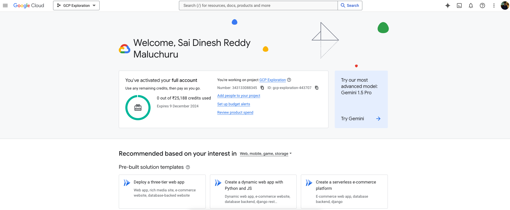

# GCP Services for ML Engineering and Data Engineering

## Following is the plan to explore the services and read documentations on the services

### Google Cloud Learning Resources Roadmap provided by Claude AI - Planned using the Claude Haiku LLM to give me resources and plan to explore GCP in two days.

## 2-Day Plan to explore GCP services and technologies.

## Day 1: Cloud Fundamentals & Data Engineering Resources

### Cloud Console & Infrastructure Setup
- **Official Setup Guide**: [Cloud Resource Manager](https://cloud.google.com/resource-manager/docs/creating-managing-projects)
- **Free Credits**: [Google Cloud Free Tier](https://cloud.google.com/free)
- **SDK Installation**: [Google Cloud SDK Install](https://cloud.google.com/sdk/docs/install)

### Cloud Fundamentals & Networking
- **Compute Engine Tutorial**: [Quickstart Linux](https://cloud.google.com/compute/docs/quickstart-linux)
- **Networking Guide**: [VPC Overview](https://cloud.google.com/vpc/docs/overview)
- **IAM Documentation**: [Identity Management Quickstart](https://cloud.google.com/iam/docs/quickstart)

### Data Engineering Foundations
- **BigQuery Quickstart**: [BigQuery Basics](https://cloud.google.com/bigquery/docs/quickstarts)
- **SQL Tutorial**: [BigQuery SQL Guide](https://cloud.google.com/bigquery/docs/tutorials)
- **Cloud Storage Guide**: [Storage Quickstart](https://cloud.google.com/storage/docs/quickstart-console)

### Advanced Data Engineering
- **Dataflow Tutorial**: [Dataflow Quickstarts](https://cloud.google.com/dataflow/docs/quickstarts)
- **Apache Beam Guide**: [Getting Started](https://beam.apache.org/get-started/quickstart-py/)
- **Data Processing Examples**: [Dataflow Samples](https://github.com/GoogleCloudPlatform/dataflow-samples)

### Machine Learning Infrastructure
- **Vertex AI Overview**: [Getting Started](https://cloud.google.com/vertex-ai/docs/start)
- **AutoML Tutorial**: [AutoML Quickstart](https://cloud.google.com/automl/docs/quickstart)
- **GPU Setup Guide**: [GPU Configuration](https://cloud.google.com/compute/docs/gpus/setup-gpus)

### Practical ML Project Resources
- **TensorFlow Tutorials**: [Official Tutorials](https://www.tensorflow.org/tutorials)
- **Kaggle Datasets**: [Machine Learning Datasets](https://www.kaggle.com/datasets)
- **Google Colab**: [Online Notebook Environment](https://colab.research.google.com/)

## Day 2: Deep Learning & Advanced Implementations

### Deep Learning Foundations
- **PyTorch Tutorials**: [Official Tutorials](https://pytorch.org/tutorials/)
- **TensorFlow Learn**: [Learning Resources](https://www.tensorflow.org/learn)
- **Transfer Learning Guide**: [Image Transfer Learning](https://www.tensorflow.org/tutorials/images/transfer_learning)

### Practical Deep Learning
- **Image Classification Tutorial**: [TensorFlow Classification](https://www.tensorflow.org/tutorials/images/classification)
- **Keras Model Training**: [Training Methods](https://keras.io/guides/training_with_built_in_methods/)
- **Hyperparameter Optimization**: [Vertex AI Tuning](https://cloud.google.com/vertex-ai/docs/training/hyperparameter-tuning-overview)

### Advanced ML Techniques
- **MLOps Principles**: [Continuous Delivery Pipelines](https://cloud.google.com/architecture/mlops-continuous-delivery-and-automation-pipelines-in-machine-learning)
- **Model Monitoring**: [Vertex AI Monitoring](https://cloud.google.com/vertex-ai/docs/model-monitoring/overview)
- **Deployment Strategies**: [Model Prediction Deployment](https://cloud.google.com/vertex-ai/docs/predictions/deploy-model)

### Real-world Project Resources
- **Churn Prediction Tutorial**: [Customer Churn ML](https://cloud.google.com/solutions/machine-learning/predicting-customer-churn-tutorial)
- **Feature Engineering**: [Structured Data Features](https://www.tensorflow.org/tutorials/structured_data/feature_columns)

### Cloud Cost Optimization
- **Cost Management**: [Google Cloud Cost Tools](https://cloud.google.com/cost-management)
- **Pricing Calculator**: [Cloud Pricing Estimator](https://cloud.google.com/products/calculator)
- **Resource Optimization**: [Cloud Recommender](https://cloud.google.com/recommender/docs/optimize-cost)

### Project Documentation & Performance
- **Documentation Template**: [Cloud Documentation](https://cloud.google.com/docs/templates)
- **Performance Metrics Guide**: [Cloud Monitoring](https://cloud.google.com/monitoring/docs/monitoring_overview)

## Additional Comprehensive Learning Resources
- [Google Cloud Skills Boost](https://www.cloudskillsboost.google/)
- [Coursera Google Cloud Path](https://www.coursera.org/googlecloud)
- [GitHub Learning Repositories](https://github.com/GoogleCloudPlatform/)

## 🚀 Pro Learning Tips

1. **Parallel Learning**
   - Open multiple browser tabs for comprehensive resource exploration
   - Create a structured learning environment

2. **Active Learning Techniques**
   - Take detailed, structured notes for each resource
   - Screenshot key configurations and code snippets
   - Create a personal knowledge repository

3. **Practical Implementation**
   - Practice immediate implementation of learned concepts
   - Build small projects to reinforce understanding
   - Experiment with different cloud services and tools

### Recommended Learning Approach

- **Focus on Hands-on Experience**: 60% practical work
- **Theoretical Understanding**: 30% documentation and tutorials
- **Reflection and Documentation**: 10% summarizing and noting learnings

# Implementation of the plan :

## Day 1: Cloud Fundamentals & Data Engineering Resources :

### Setting up :

### Project setup and google SDK installation

