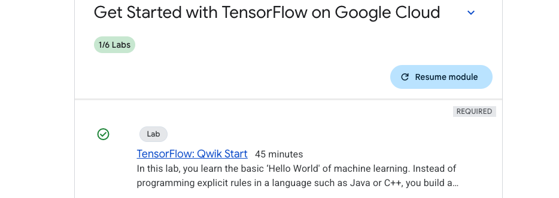

# Tenserflow to classify images

- we will be using google cloud to do this dive deep tut.
- Link to the [Skill](https://www.cloudskillsboost.google/course_templates/646)


## Classify Images with TensorFlow on Google Cloud

- This course will give much needed recap and clarity on Tenserflow basics
- As this tut also provides GCP guest login, it would also provide as a recap for gcp cloud basics.


### Lab 1 : TensorFlow: Qwik Start - [link](https://www.cloudskillsboost.google/course_templates/646/labs/503712)

#### Objectives of this lab
- Set up the development environment in the Jupyter notebook
- Design a machine learning model
- Train a neural network
- Test a model

#### Notes :
- we can write rules for every scenario in traditional programming for example to track which physical activity a personal is doing (like walking/running/cycling) but for complex activity like golf it would be difficult in some cases impossible.


- But instead of writing rules in programming language if I directly provide answers (labelled data) along with the data, the machine infers the rules and determine the relationship between answers and data.


- we will be using the VertexAI , workbench to build a basic hello world model. installing and setting up dependent libraries in vertex ai instance

```py
pip3 install tensorflow

pip3 install --upgrade pip

# pylink used for checking errors in python code and highlights syntactical problems
pip install -U pylint --user

# this will install the modules present in the file
pip install -r requirements.txt

#base) jupyter@vertex-ai-jupyterlab:~$ cat requirements.txt 
# google-cloud-logging
# tensorflow
# tensorflow-datasets
# numpy 
# scipy
# protobuf
```

- creating a first ml model in vertex ai , in notebook we will install logging modules


```py
import logging
import google.cloud.logging as cloud_logging
from google.cloud.logging.handlers import CloudLoggingHandler
from google.cloud.logging_v2.handlers import setup_logging

cloud_logger = logging.getLogger('cloudLogger')
cloud_logger.setLevel(logging.INFO)
cloud_logger.addHandler(CloudLoggingHandler(cloud_logging.Client()))
cloud_logger.addHandler(logging.StreamHandler())


# Import TensorFlow
import tensorflow as tf

# Prepare the dummy data, numpy provides lot of array type data structures that are defacto way to feed data
xs = np.array([-1.0, 0.0, 1.0, 2.0, 3.0, 4.0], dtype=float)
ys = np.array([-2.0, 1.0, 4.0, 7.0, 10.0, 13.0], dtype=float)

```
- Designing the model, neural network : 1 layer and 1 neuron. The neural network input is one at a time. You must specify 2 functions, a loss and an optimizer.

```py
model = tf.keras.Sequential([tf.keras.layers.Dense(units=1, input_shape=[1])])

model.compile(optimizer=tf.keras.optimizers.SGD(), loss=tf.keras.losses.MeanSquaredError())

model.fit(xs, ys, epochs=500)

import logging
import google.cloud.logging as cloud_logging
from google.cloud.logging.handlers import CloudLoggingHandler
from google.cloud.logging_v2.handlers import setup_logging

cloud_logger = logging.getLogger('cloudLogger')
cloud_logger.setLevel(logging.INFO)
cloud_logger.addHandler(CloudLoggingHandler(cloud_logging.Client()))
cloud_logger.addHandler(logging.StreamHandler())

import tensorflow as tf
import numpy as np

xs = np.array([-1.0, 0.0, 1.0, 2.0, 3.0, 4.0], dtype=float)
ys = np.array([-2.0, 1.0, 4.0, 7.0, 10.0, 13.0], dtype=float)

model = tf.keras.Sequential([tf.keras.layers.Dense(units=1, input_shape=[1])])

model.compile(optimizer=tf.keras.optimizers.SGD(), loss=tf.keras.losses.MeanSquaredError())

model.fit(xs, ys, epochs=500)

```
- Documentation from the lab , important points picked for reference
    - the relationship between the numbers for above ref is y=3x+1. (picked from documentation)
    - When the computer is trying to learn this relationship, it makes a guess...maybe y=10x+10. The loss function measures the guessed answers against the known correct answers and measures how well or how badly it did.
    - Note: Learn more about different types of loss functions available in tf.keras from the [Module: tf.keras.losses documentation.](https://keras.io/api/losses/)
    - Next, the model uses the optimizer function to make another guess. Based on the loss function's result, it will try to minimize the loss. At this point, maybe it will come up with something like y=5x+5. While this is still pretty bad, it's closer to the correct result (i.e. the loss is lower).
    - Note: Learn more about different types of [optimizers available in tf.keras from the Module: tf.keras.optimizers documentation.](https://www.tensorflow.org/api_docs/python/tf/keras/optimizers)
    - Learn more about model.fit from the [fit section of the tf.keras.Model documentation.](https://www.tensorflow.org/api_docs/python/tf/keras/Model#fit)
    - A number with e- in the value is being displayed in scientific notation with a negative exponent.


- model.predict method to figure out the Y for an X not previously seen by the model during training

```py
cloud_logger.info(str(model.predict(np.array([10.0]))))


```


- Completed the module 1




### Lab 2 : Introduction to Computer Vision with TensorFlow - [link](https://www.cloudskillsboost.google/course_templates/646/labs/503713)

#### Objectives of the lab:
- Design, compile, train and evaluate a Tensorflow model
- Save and load models
- Write your own callbacks to customize behavior during training
- Complete a series of exercises to guide you through experimenting with the different layers of the network


#### Notes:

- 


### Continued...