# Basics of TensorFlow using GCP

- we will be using google cloud to do this dive deep tut.
- Link to the [Skill](https://www.cloudskillsboost.google/course_templates/646)
- First going over all the main concepts in tensorflow and how we can understand each item at very indepth level.


## Neural Network basics and TenserFlow basics

## Neural Network Basics

### What is a Neural Network?
### Key Components of Neural Networks
### How Neural Networks Learn

## TensorFlow Basics and Activation Functions

### Introduction to TensorFlow
### Common Activation Functions and Their Roles

## Loss Functions in Deep Learning

### Overview of Loss Functions
### Choosing the Right Loss Function

## Training a Basic Model

### Building and Compiling Your Model
### The Training Process and Best Practices

## Simple Neural Network for Negative-to-Positive Classification

This section demonstrates a very simple neural network. The network is trained on inputs ranging from -12 to 12, with a target output of 0 for negative values and 1 for positive values. The input is normalized by dividing by 12 to map values to a [-1, 1] range. A single neuron with a sigmoid activation function is used, and the model is compiled with the Adam optimizer and binary crossentropy loss.

### Training

```python
import numpy as np
import tensorflow as tf

# Create synthetic training data: inputs between -12 and 12
x_train = np.linspace(-12, 12, num=1000)
y_train = (x_train >= 0).astype(np.float32)  # Output 1 if x >= 0, else 0

# Normalize the input to the range [-1, 1]
x_train_norm = x_train / 12.0

# Define a simple sequential model with one neuron
model = tf.keras.Sequential([
  tf.keras.layers.Input(shape=(1,)),
  tf.keras.layers.Dense(1, activation='sigmoid')
])

# Compile the model with Adam optimizer and binary crossentropy loss
model.compile(optimizer=tf.keras.optimizers.Adam(learning_rate=0.01),
        loss=tf.keras.losses.BinaryCrossentropy(),
        metrics=['accuracy'])

# Train the model
model.fit(x_train_norm, y_train, epochs=50, batch_size=32)
```

### Inference

```python
# Test the trained model with new inputs
test_inputs = np.array([-15, -6, 0, 3, 15], dtype=np.float32)
test_inputs_norm = test_inputs / 12.0

# Get predictions (raw values)
predictions = model.predict(test_inputs_norm)
print("Test Inputs:", test_inputs)
print("Raw Predictions:", predictions)

# Convert raw predictions to binary outputs using a 0.5 threshold
binary_predictions = (predictions > 0.5).astype(int)
print("Binary Predictions:", binary_predictions)
```


## Classify Images with TensorFlow on Google Cloud

- This course will give much needed recap and clarity on Tenserflow basics
- As this tut also provides GCP guest login, it would also provide as a recap for gcp cloud basics.


### Lab 1 : TensorFlow: Qwik Start - [link](https://www.cloudskillsboost.google/course_templates/646/labs/503712)

#### Objectives of this lab
- Set up the development environment in the Jupyter notebook
- Design a machine learning model
- Train a neural network
- Test a model

#### Notes :
- we can write rules for every scenario in traditional programming for example to track which physical activity a personal is doing (like walking/running/cycling) but for complex activity like golf it would be difficult in some cases impossible.

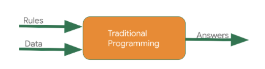

- But instead of writing rules in programming language if I directly provide answers (labelled data) along with the data, the machine infers the rules and determine the relationship between answers and data.


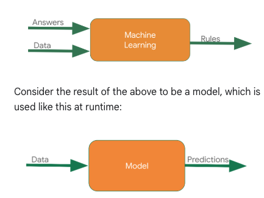


- we will be using the VertexAI , workbench to build a basic hello world model. installing and setting up dependent libraries in vertex ai instance

```py
pip3 install tensorflow

pip3 install --upgrade pip

# pylink used for checking errors in python code and highlights syntactical problems
pip install -U pylint --user

# this will install the modules present in the file
pip install -r requirements.txt

#base) jupyter@vertex-ai-jupyterlab:~$ cat requirements.txt 
# google-cloud-logging
# tensorflow
# tensorflow-datasets
# numpy 
# scipy
# protobuf
```

- creating a first ml model in vertex ai , in notebook we will install logging modules

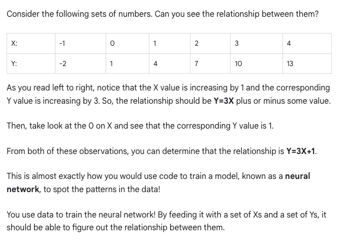

```py
import logging
import google.cloud.logging as cloud_logging
from google.cloud.logging.handlers import CloudLoggingHandler
from google.cloud.logging_v2.handlers import setup_logging

cloud_logger = logging.getLogger('cloudLogger')
cloud_logger.setLevel(logging.INFO)
cloud_logger.addHandler(CloudLoggingHandler(cloud_logging.Client()))
cloud_logger.addHandler(logging.StreamHandler())


# Import TensorFlow
import tensorflow as tf

# Prepare the dummy data, numpy provides lot of array type data structures that are defacto way to feed data
xs = np.array([-1.0, 0.0, 1.0, 2.0, 3.0, 4.0], dtype=float)
ys = np.array([-2.0, 1.0, 4.0, 7.0, 10.0, 13.0], dtype=float)

```
- Designing the model, neural network : 1 layer and 1 neuron. The neural network input is one at a time. You must specify 2 functions, a loss and an optimizer.

```py
model = tf.keras.Sequential([tf.keras.layers.Dense(units=1, input_shape=[1])])

model.compile(optimizer=tf.keras.optimizers.SGD(), loss=tf.keras.losses.MeanSquaredError())

model.fit(xs, ys, epochs=500)

import logging
import google.cloud.logging as cloud_logging
from google.cloud.logging.handlers import CloudLoggingHandler
from google.cloud.logging_v2.handlers import setup_logging

cloud_logger = logging.getLogger('cloudLogger')
cloud_logger.setLevel(logging.INFO)
cloud_logger.addHandler(CloudLoggingHandler(cloud_logging.Client()))
cloud_logger.addHandler(logging.StreamHandler())

import tensorflow as tf
import numpy as np

xs = np.array([-1.0, 0.0, 1.0, 2.0, 3.0, 4.0], dtype=float)
ys = np.array([-2.0, 1.0, 4.0, 7.0, 10.0, 13.0], dtype=float)

model = tf.keras.Sequential([tf.keras.layers.Dense(units=1, input_shape=[1])])

model.compile(optimizer=tf.keras.optimizers.SGD(), loss=tf.keras.losses.MeanSquaredError())

model.fit(xs, ys, epochs=500)

```
- Documentation from the lab , important points picked for reference
    - the relationship between the numbers for above ref is y=3x+1. (picked from documentation)
    - When the computer is trying to learn this relationship, it makes a guess...maybe y=10x+10. The loss function measures the guessed answers against the known correct answers and measures how well or how badly it did.
    - Note: Learn more about different types of loss functions available in tf.keras from the [Module: tf.keras.losses documentation.](https://keras.io/api/losses/)
    - Next, the model uses the optimizer function to make another guess. Based on the loss function's result, it will try to minimize the loss. At this point, maybe it will come up with something like y=5x+5. While this is still pretty bad, it's closer to the correct result (i.e. the loss is lower).
    - Note: Learn more about different types of [optimizers available in tf.keras from the Module: tf.keras.optimizers documentation.](https://www.tensorflow.org/api_docs/python/tf/keras/optimizers)
    - Learn more about model.fit from the [fit section of the tf.keras.Model documentation.](https://www.tensorflow.org/api_docs/python/tf/keras/Model#fit)
    - A number with e- in the value is being displayed in scientific notation with a negative exponent.


- model.predict method to figure out the Y for an X not previously seen by the model during training

```py
cloud_logger.info(str(model.predict(np.array([10.0]))))


```

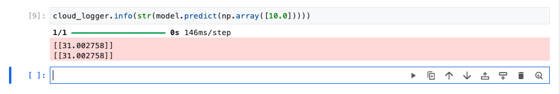

- Completed the module 1

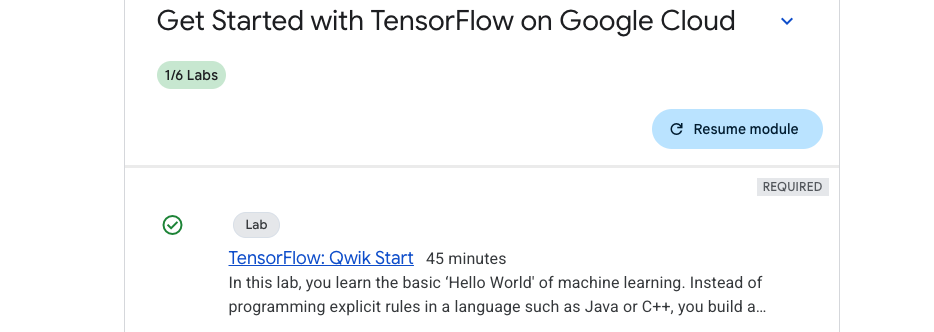


### Lab 2 : Introduction to Computer Vision with TensorFlow - [link](https://www.cloudskillsboost.google/course_templates/646/labs/503713)

#### Objectives of the lab:
- Design, compile, train and evaluate a Tensorflow model
- Save and load models
- Write your own callbacks to customize behavior during training
- Complete a series of exercises to guide you through experimenting with the different layers of the network


#### Notes:

- Lets understand about neural networks, weights, activation functions so that we can understand indepth about how does training works in a neural network. Also tensorflow is a framework to train neural network models.
- NN is kind of inspired from operations of brain, consists of layers (some hidden), a node in NN takes in multiple input values and generate one output value. The neuron calculates weighted sum and applies activation function (non-linearity) to calculate the output value. 
- This lab has many readings, listing below for easier reference.
- More about hidden layer - [hidden layer](https://developers.google.com/machine-learning/glossary/#hidden_layer)
- 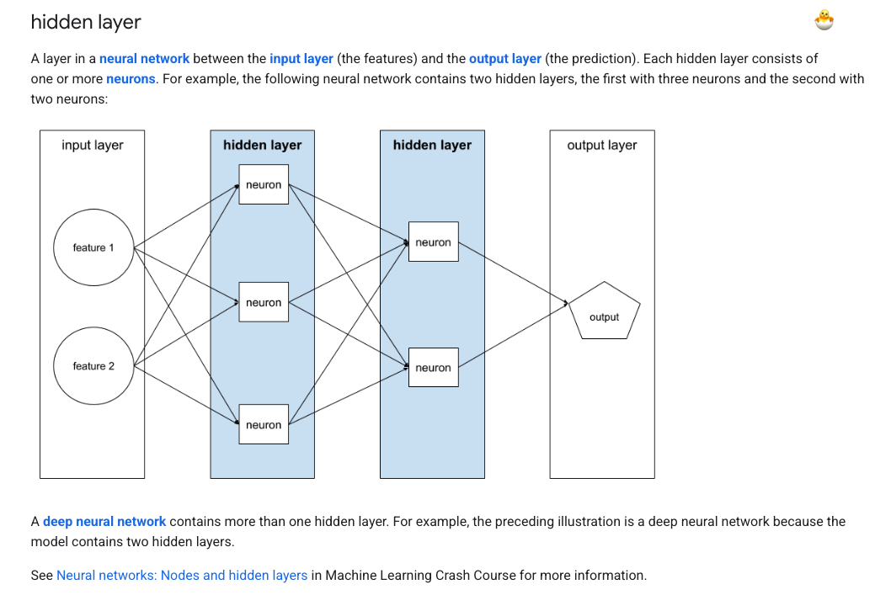
- More on Activation Function - [Activation function](https://developers.google.com/machine-learning/glossary/#activation_function)
- 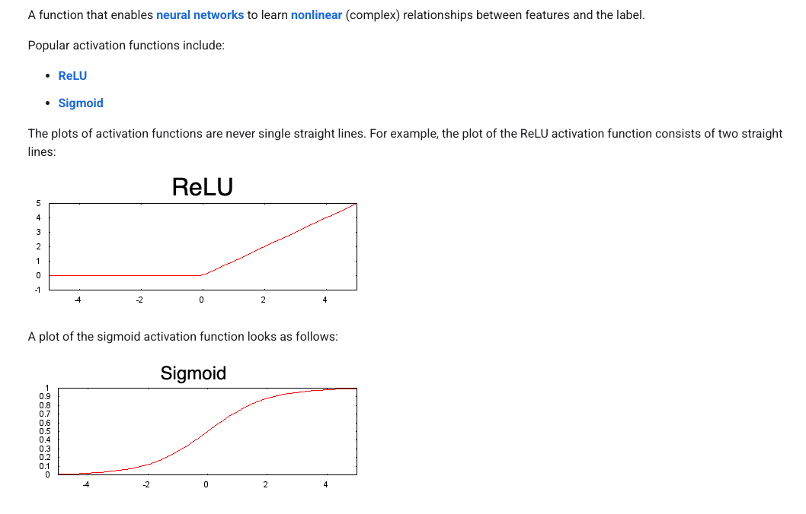
- Best visual understanding of how weights and activation functions moves - [hands-on](https://developers.google.com/machine-learning/crash-course/neural-networks/nodes-hidden-layers)
- All the available datasets in tensorflow_datasets - [all_datasets](https://www.tensorflow.org/datasets/catalog/overview#all_datasets)

```python
import tensorflow_datasets as tfds
```
- Go to vertex AI instance and workbench to go to the instance, adding few commands and comments I am executing. Installing packages in the workbench using terminal.

```python
python --version
pip3 install tensorflow
pip install -U pylint --user

#(base) jupyter@vertex-ai-jupyterlab:~$ cat requirements.txt
google-cloud-logging
tensorflow
tensorflow-datasets
numpy 
scipy
protobuf

```
- After installing the packages, executing below commands


```python


# Import and configure logging
import logging
import google.cloud.logging as cloud_logging
from google.cloud.logging.handlers import CloudLoggingHandler
from google.cloud.logging_v2.handlers import setup_logging

cloud_logger = logging.getLogger('cloudLogger')
cloud_logger.setLevel(logging.INFO)
cloud_logger.addHandler(CloudLoggingHandler(cloud_logging.Client()))
cloud_logger.addHandler(logging.StreamHandler())


# Import TensorFlow
import tensorflow as tf

# Import numpy
import numpy as np

# Import tensorflow_datasets, i included the dataset link to see other datasets which are available
import tensorflow_datasets as tfds

```

- In this exercise we are training a neural net to classify images, the dataset we are using is [https://github.com/zalandoresearch/fashion-mnist](https://github.com/zalandoresearch/fashion-mnist), the dataset contains 70k items of clothing belonging to 10 different categories

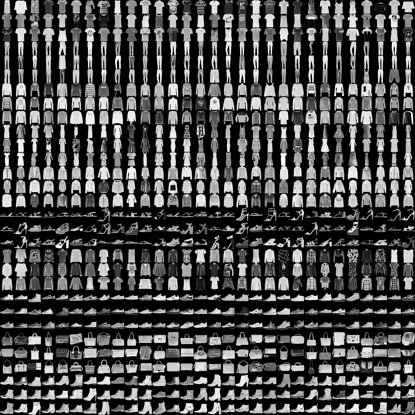

- For this ex, the training will be with 60k and testing with 10k to evaluate the trained model.
- load the dataset as below and split, more on loading ([tfds.load](https://www.tensorflow.org/datasets/api_docs/python/tfds/load))
- 


```python
# Define, load and configure data
(ds_train, ds_test), info = tfds.load('fashion_mnist', split=['train', 'test'], with_info=True, as_supervised=True)
#Next, add print statements to see the min and max values of training images for item 0. Add the following code to the second cell:
# Values before normalization
image_batch, labels_batch = next(iter(ds_train))
print("Before normalization ->", np.min(image_batch[0]), np.max(image_batch[0]))


#Batch size is a term used in machine learning and refers to the number of training examples utilized in one iteration. You will set this to a value of 32.
# Define batch size
BATCH_SIZE = 32

#When training a neural network, for various reasons it's easier if you scale the pixel values to the range between 0 to 1. This process is called 'normalization'. Since the pixel values for FashionMNIST dataset are in the range of [0, 255], you will divide the pixel values by 255.0 to normalize the images.

# Normalize and batch process the dataset
ds_train = ds_train.map(lambda x, y: (tf.cast(x, tf.float32)/255.0, y)).batch(BATCH_SIZE)
ds_test = ds_test.map(lambda x, y: (tf.cast(x, tf.float32)/255.0, y)).batch(BATCH_SIZE)

#Re-print the min and max values of an image in the train dataset:

# Examine the min and max values of the batch after normalization
image_batch, labels_batch = next(iter(ds_train))
print("After normalization ->", np.min(image_batch[0]), np.max(image_batch[0]))

#Design, compile, and train the model

# Define the model
model = tf.keras.models.Sequential([tf.keras.layers.Flatten(),
                                    tf.keras.layers.Dense(64, activation=tf.nn.relu),
                                    tf.keras.layers.Dense(10, activation=tf.nn.softmax)])


# Look at the different types of layers and the parameters used in the model architecture:

# Sequential: This defines a SEQUENCE of layers in the neural network.

# Flatten: Our images are of shape (28, 28), i.e, the values are in the form of a square matrix. Flatten takes that square and turns it into a one-dimensional vector.

# Dense: Adds a layer of neurons.

# Each layer of neurons needs an activation function to decide if a neuron should be activated or not. There are lots of options, but this lab uses the following ones.

# Relu effectively means if X>0 return X, else return 0. It passes values 0 or greater to the next layer in the network.
# Softmax takes a set of values, and effectively picks the biggest one so you don't have to sort to find the largest value. For example, if the output of the last layer looks like [0.1, 0.1, 0.05, 0.1, 9.5, 0.1, 0.05, 0.05, 0.05], it returns [0,0,0,0,1,0,0,0,0].
# Compile and train the model
# In this section you will first compile your model with an optimizer and loss function. You will then train the model on your training data and labels.

# The goal is for the model to figure out the relationship between the training data and its labels. Once training is complete, you want your model to see fresh images of clothing that resembles your training data and make predictions about what class of clothing they belong to.

# An optimizer is one of the two arguments required for compiling a tf.keras model. An Optimizer is an algorithm that modifies the attributes of the neural network like weights and learning rate. This helps in reducing the loss and improving accuracy.


```

- Optimizers : [Optimizers](https://www.tensorflow.org/api_docs/python/tf/keras/optimizers), Loss Function : [Loss](https://www.tensorflow.org/api_docs/python/tf/keras/losses) , Metric Paramters : [Params](https://www.tensorflow.org/api_docs/python/tf/keras/metrics)

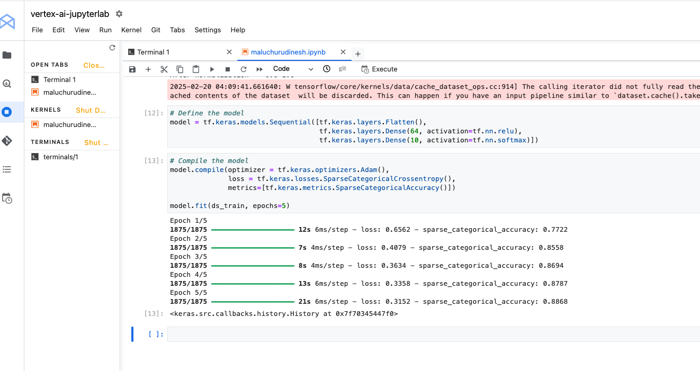

- Evaluating the model , and saving the model

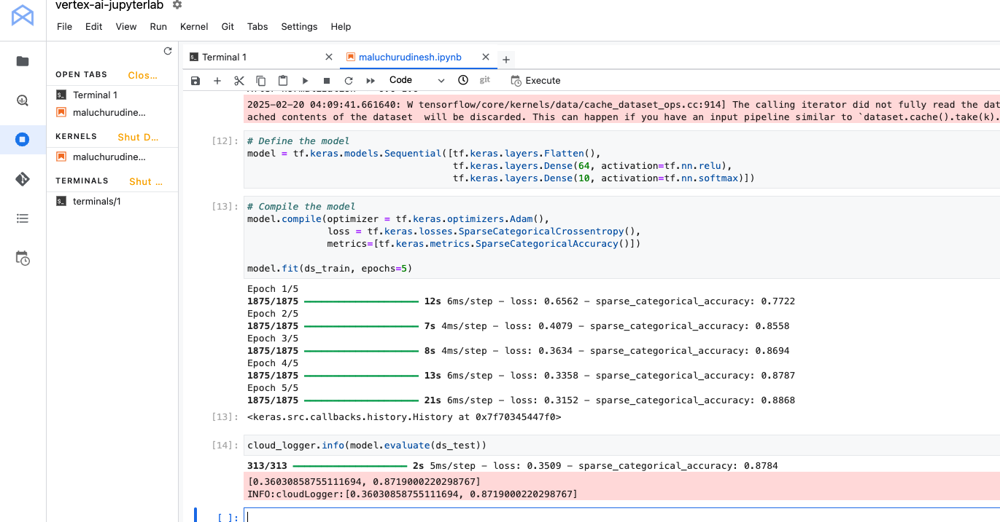


```python

cloud_logger.info(model.evaluate(ds_test))

# Save the entire model as a Keras model using .keras format
model.save('saved_model.keras') 

# Load the model using custom_objects to handle the custom activation function
new_model = tf.keras.models.load_model('saved_model.keras', custom_objects={'softmax_v2': tf.keras.activations.softmax})

# Summary of loaded SavedModel
new_model.summary()

# Save the entire model to a keras file.
model.save('my_model.keras')

# Recreate the exact same model, including its weights and the optimizer
new_model_keras = tf.keras.models.load_model('my_model.keras', custom_objects={'softmax_v2': tf.keras.activations.softmax})

# Summary of loaded keras model
new_model_keras.summary()

```

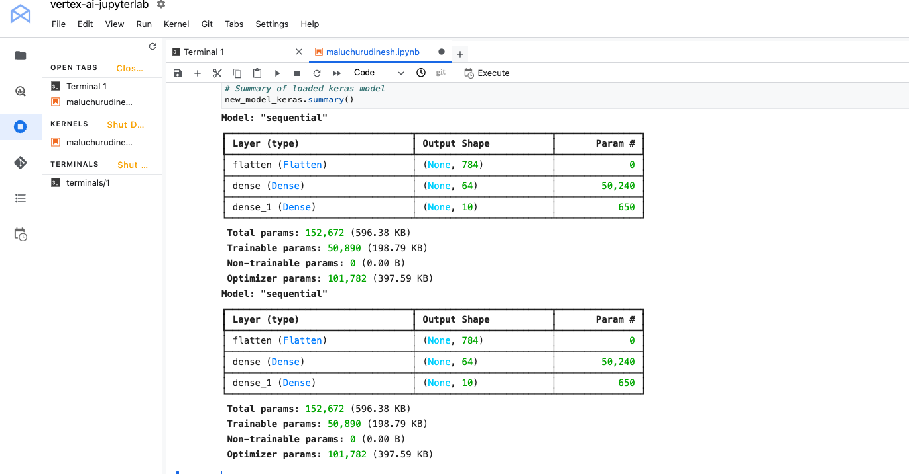

-  callback is a powerful tool to customize the behavior of a Keras model during training, evaluation, or inference. You can define a callback to stop training as soon as your model reaches a desired accuracy on the training set.


```python
# Import and configure logging
import logging
import google.cloud.logging as cloud_logging
from google.cloud.logging.handlers import CloudLoggingHandler
from google.cloud.logging_v2.handlers import setup_logging
exp_logger = logging.getLogger('expLogger')
exp_logger.setLevel(logging.INFO)
exp_logger.addHandler(CloudLoggingHandler(cloud_logging.Client(), name="callback"))

# Import tensorflow_datasets
import tensorflow_datasets as tfds
# Import numpy
import numpy as np
# Import TensorFlow
import tensorflow as tf
# Define Callback
class myCallback(tf.keras.callbacks.Callback):
  def on_epoch_end(self, epoch, logs={}):
    if(logs.get('sparse_categorical_accuracy')>0.84):
      exp_logger.info("\nReached 84% accuracy so cancelling training!")
      self.model.stop_training = True
callbacks = myCallback()
# Define, load and configure data
(ds_train, ds_test), info = tfds.load('fashion_mnist', split=['train', 'test'], with_info=True, as_supervised=True)
# Define batch size
BATCH_SIZE = 32
# Normalizing and batch processing of data
ds_train = ds_train.map(lambda x, y: (tf.cast(x, tf.float32)/255.0, y)).batch(BATCH_SIZE)
ds_test = ds_test.map(lambda x, y: (tf.cast(x, tf.float32)/255.0, y)).batch(BATCH_SIZE)
# Define the model
model = tf.keras.models.Sequential([tf.keras.layers.Flatten(),
                                    tf.keras.layers.Dense(64, activation=tf.nn.relu),
                                    tf.keras.layers.Dense(10, activation=tf.nn.softmax)])
# Compile data
model.compile(optimizer = tf.keras.optimizers.Adam(),
              loss = tf.keras.losses.SparseCategoricalCrossentropy(),
              metrics=[tf.keras.metrics.SparseCategoricalAccuracy()])
model.fit(ds_train, epochs=5, callbacks=[callbacks])
```


- Exercises

```python
# Define the model
# Import and configure logging
import logging
import google.cloud.logging as cloud_logging
from google.cloud.logging.handlers import CloudLoggingHandler
from google.cloud.logging_v2.handlers import setup_logging
up_logger = logging.getLogger('upLogger')
up_logger.setLevel(logging.INFO)
up_logger.addHandler(CloudLoggingHandler(cloud_logging.Client(), name="updated"))

# Import tensorflow_datasets
import tensorflow_datasets as tfds
# Import numpy
import numpy as np
# Import TensorFlow
import tensorflow as tf

# Define, load and configure data
(ds_train, ds_test), info = tfds.load('fashion_mnist', split=['train', 'test'], with_info=True, as_supervised=True)
# Define batch size
BATCH_SIZE = 32
# Normalizing and batch processing of data
ds_train = ds_train.map(lambda x, y: (tf.cast(x, tf.float32)/255.0, y)).batch(BATCH_SIZE)
ds_test = ds_test.map(lambda x, y: (tf.cast(x, tf.float32)/255.0, y)).batch(BATCH_SIZE)
# Define the model
#model = tf.keras.models.Sequential([tf.keras.layers.Flatten(),
#                                    tf.keras.layers.Dense(64, activation=tf.nn.relu),
#                                    tf.keras.layers.Dense(10, activation=tf.nn.softmax)])

# Define the model
model = tf.keras.models.Sequential([tf.keras.layers.Flatten(),
                                    tf.keras.layers.Dense(128, activation=tf.nn.relu),
                                    tf.keras.layers.Dense(10, activation=tf.nn.softmax)])

# Compile data
model.compile(optimizer = tf.keras.optimizers.Adam(),
              loss = tf.keras.losses.SparseCategoricalCrossentropy(),
              metrics=[tf.keras.metrics.SparseCategoricalAccuracy()])
model.fit(ds_train, epochs=5)
# Logs model summary
model.summary(print_fn=up_logger.info)

# When you increase to 128 neurons, you have to do more calculations. This slows down the training process. In this case, the increase had a positive impact because the model is more accurate. But, it's not always a case of 'more is better'. You can hit the law of diminishing returns very quickly.

# additional layers

# Define the model to below
model = tf.keras.models.Sequential([tf.keras.layers.Flatten(),
                                    tf.keras.layers.Dense(64, activation=tf.nn.relu),
                                    tf.keras.layers.Dense(64, activation=tf.nn.relu),
                                    tf.keras.layers.Dense(10, activation=tf.nn.softmax)])

```

- Before you trained your model, you normalized the pixel values to the range of [0, 1]. What would be the impact of removing normalization so that the values are in the range of [0, 255], like they were originally in the dataset?

```python

# Import and configure logging
import logging
import google.cloud.logging as cloud_logging
from google.cloud.logging.handlers import CloudLoggingHandler
from google.cloud.logging_v2.handlers import setup_logging
up_logger = logging.getLogger('upLogger')
up_logger.setLevel(logging.INFO)
up_logger.addHandler(CloudLoggingHandler(cloud_logging.Client(), name="updated"))

# Import tensorflow_datasets
import tensorflow_datasets as tfds
# Import numpy
import numpy as np
# Import TensorFlow
import tensorflow as tf

# Define, load and configure data
(ds_train, ds_test), info = tfds.load('fashion_mnist', split=['train', 'test'], with_info=True, as_supervised=True)
# Define batch size
BATCH_SIZE = 32
# Normalizing and batch processing of data
ds_train = ds_train.batch(BATCH_SIZE)
ds_test = ds_test.batch(BATCH_SIZE)
# Define the model
model = tf.keras.models.Sequential([tf.keras.layers.Flatten(),
                                    tf.keras.layers.Dense(64, activation=tf.nn.relu),
                                    tf.keras.layers.Dense(10, activation=tf.nn.softmax)])
# Compile data
model.compile(optimizer = tf.keras.optimizers.Adam(),
              loss = tf.keras.losses.SparseCategoricalCrossentropy(),
              metrics=[tf.keras.metrics.SparseCategoricalAccuracy()])
model.fit(ds_train, epochs=5)
# Logs model summary
model.summary(print_fn=up_logger.info)

# Print out max value to see the changes
image_batch, labels_batch = next(iter(ds_train))
t_image_batch, t_labels_batch = next(iter(ds_test))
up_logger.info("training images max " + str(np.max(image_batch[0])))
up_logger.info("test images max " + str(np.max(t_image_batch[0])))

```
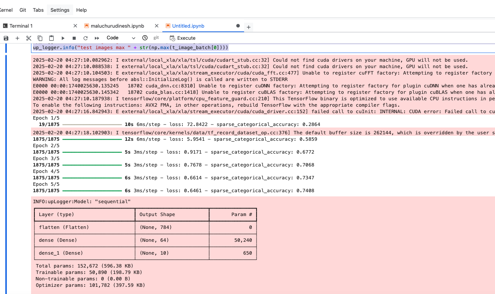


### Continued...