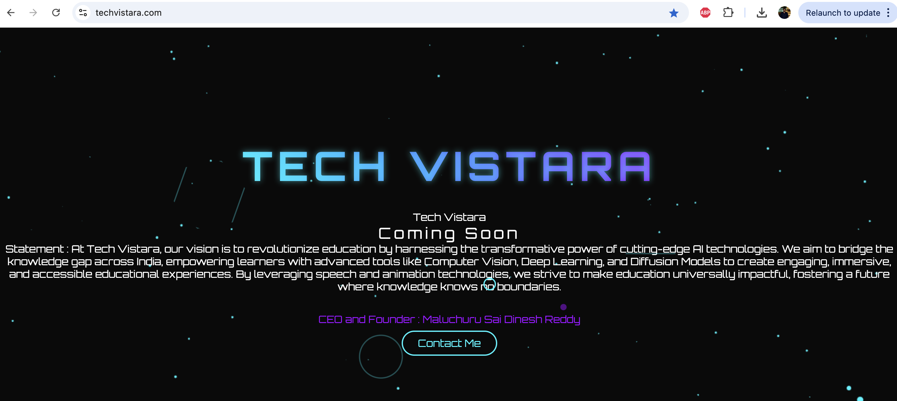

# Documenting the journey of a startup. 
## Will include the process of Legal, Registration and Operations. 

## Tentative Company name : Tech Vistara

## Mission Statement 

#### At Tech Vistara, our vision is to revolutionize education by harnessing the transformative power of cutting-edge AI technologies. We aim to bridge the knowledge gap across India, empowering learners with advanced tools like Computer Vision, Deep Learning, and Diffusion Models to create engaging, immersive, and accessible educational experiences. By leveraging speech and animation technologies, we strive to make education universally impactful, fostering a future where knowledge knows no boundaries.

## Progress

- Purchased the Domains on **Hostinger** 
- Purchased two domains with .com and .in 
- Domain Names : [techvistara.com](https://techvistara.com) , [techvistara.in](https://techvistara.in)
- Hosted a landing page using replit-ai and Azure web app : [Tech Vistara](https://techvistara.azurewebsites.net/)

- Pointed the purchased domains in hostinger to the above webapp.

### Company building in progress